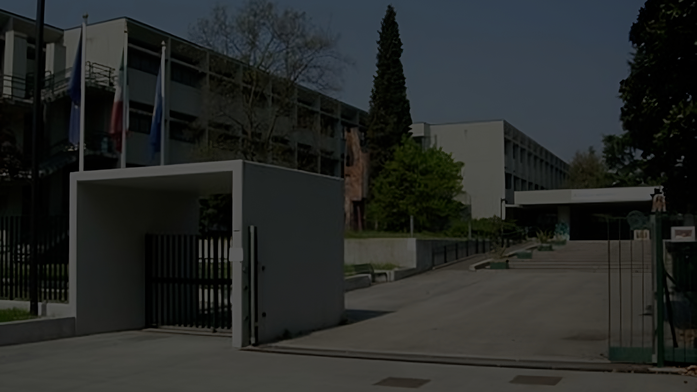
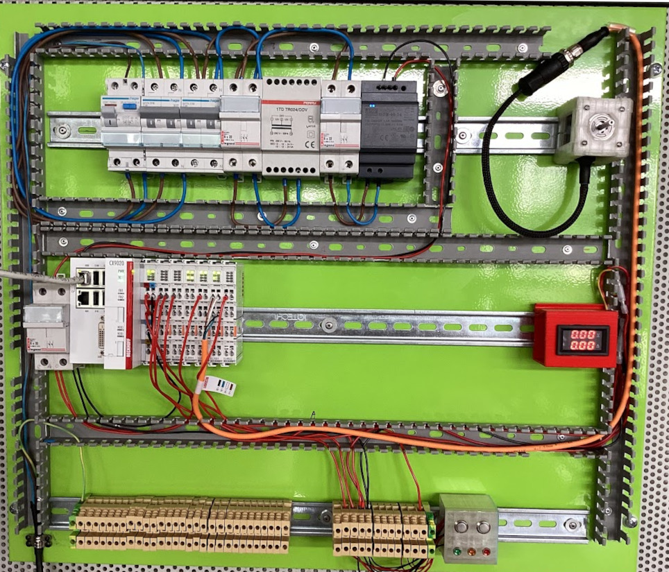
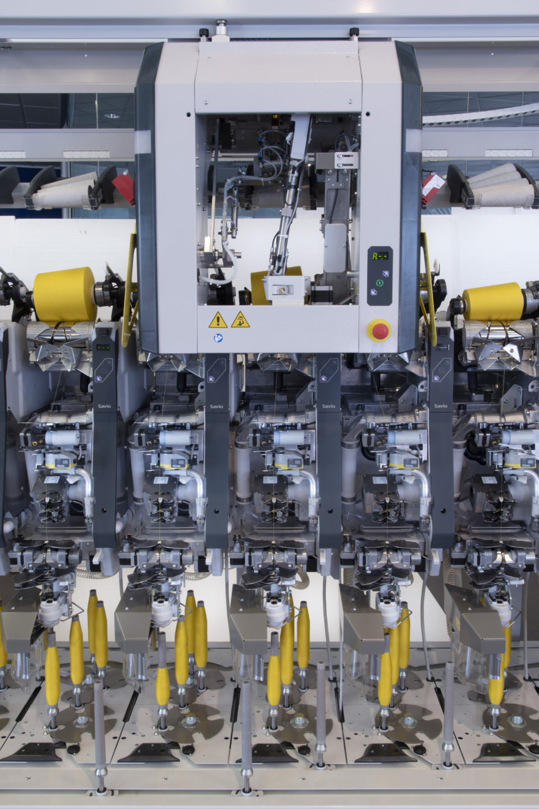

<!-- _class: titlepage titlepagev2 -->

# ANNO DI    FORMAZIONE E PROVA 2022/23

## Docente neoassunto: **Flavio Barisi**
## Docente tutor: **Pietro Piol**

---

<!-- _class: summarypage -->

# Sommario

- [Didattica](#didattica)
- [Bilancio iniziale delle competenze](#bilancio-iniziale-delle-competenze)
- [Formazione docenti neoassunti](#formazione-docenti-neoassunti)
- [Progettazione attività didattica Beckhoff](#attivit%C3%A0-didattica-automazione-industriale-basata-su-pc-beckhoff)
- [Bilancio finale](#bilancio-finale)

---

<!-- _class: sectionpage -->

# Didattica

---

# Attività didattica

- Anno di prova iniziato il 1/9/2022
- 764 ore di lezione
  - 22 ore settimanali
  - 3 classi disciplina **Tecnologie informatiche**
  - 3 classi disciplina **Sistemi automatici**
- 6,5 ore di scuola aperta e laboratori

---

# Classi ed incarichi

- **Tecnologie informatiche**
    - **1I**
    - **1L**
    - **1M**
- **Sistemi automatici**
    - **3AET**: Tutor PCTO
    - **3CET**
    - **4CET**: Segretario del consiglio di classe
---

<!-- _class: sectionpage -->

# Bilancio iniziale delle competenze

---

# Punti di forza

- Rispettare regole, ruoli e impegni assunti all’interno del proprio contesto professionale

- Progettare attività per la verifica delle competenze trasversali (soft skills)

- Costruire e condividere con la classe regole chiare

---

# Punti di debolezza

- Padronanza della disciplina

- Utilizzare efficacemente le tecnologie digitali per migliorare la propria professionalità

- Rendere gli studenti consapevoli dei loro progressi rispetto agli obiettivi di apprendimento

- Progettare le attività della classe, affinché queste tengano conto delle necessità degli allievi con bisogni speciali in modo da favorirne l’integrazione

---

# Patto per lo sviluppo professionale

Di seguito sono riportati gli elementi del Patto per lo Sviluppo Professionale:

- Conoscere gli elementi epistemologici delle discipline e strutturare le conoscenze  intorno ai principi fondanti delle discipline
- Essere capace di sviluppare collegamenti interdisciplinari
- Stabilire una proficua relazione con i propri allievi favorendo un clima di classe positivo
- Istituire rapporti efficaci e corretti con le famiglie

---

<!-- _class: sectionpage -->

# Formazione docenti neoassunti

---

# Attività di formazione

- Incontri propedeutici e di restituzione finale
- Laboratori formativi
- Peer to peer e osservazione in classe
- Formazione on-line

---

# Laboratori formativi

- **Durata totale**: 12 ore
- **Modalità**: online
- **Argomenti:**
    - Valutazione didattica degli apprendimenti
    - Valutazione di sistema (autovalutazione e miglioramento)
    - Innovazione della didattica delle discipline e motivazione all’apprendimento
    - Bisogni Educativi Speciali

---

<!-- _class: sectionpage -->

# Attività didattica: Automazione industriale basata su PC Beckhoff

---

# Contesto didattico

- Classe IV, V Elettrotecnica ed Elettronica
- Disciplina **Sistemi Automatici** 
- L’attività didattica è collocata all’interno di una Unità di Apprendimento chiamata *Applicazioni dei PLC*

---

# Obiettivi specifici di apprendimento

<!-- _class: small -->

**Direttiva Ministeriale n°4 2012**: Adozione delle Linee guida per il passaggio al nuovo ordinamento degli Istituti tecnici

  **Conoscenze** (Sapere…)
  - Architettura dei controllori a logica programmabile.
  - Programmazione dei controllori a logica programmabile.
  - Manualistica d’uso e di riferimento.
  - Lessico e terminologia tecnica del settore anche in lingua inglese.

  **Abilità** (Saper fare…)
  - Programmare e gestire componenti e sistemi programmabili in contesti specifici.
  - Realizzare semplici programmi relativi all’acquisizione ed elaborazione dati.
  - Sviluppare programmi applicativi per il monitoraggio e il controllo di sistemi.

---

<!-- _class: small -->

# Competenze

**Risultati di apprendimento** (D.P.R n°88 2010)
- Utilizzare linguaggi di programmazione, di diversi livelli, riferiti ad ambiti specifici di applicazione.
- Analizzare il funzionamento, progettare e implementare sistemi automatici

**Assi culturali** (D.M. n°139 2007)
- Scientifico tecnologico: osservare, descrivere e analizzare fenomeni appartenenti alla realtà naturale e artificiale e riconoscere nelle sue varie forme i concetti di sistema e complessità

**Competenze chiave di cittadinanza**
- Progettare
- Individuare collegamenti e relazioni
- Collaborare e partecipare

---

# Attività svolte

- Realizzazione prototipo quadro di automazione per attività didattiche
- Autoformazione tramite tutorial e documentazione Beckhoff
- Corso di formazione di 16 ore offerto da Beckhoff 
- Visita ISIS della Bassa Friulana di Cervignano
- Incontro con tecnici dell'azienda Savio

---

# Quadro di automazione

- Dispositivi di protezione elettrica
- Alimentatore
- PC Industriale CX9020
- Dispositivi I/O analogici e digitali
- Motore passo passo AS1010-0000
  

---

# Autoformazione

Totale impegno di circa 30 ore

- Corso Beckhoff di Jakob Sagatowski disponibile su Youtube
- Tutorial Beckhoff di Electrical Automation Hands-On disponibile su Youtube
- Tutorial di Beckhoff Eslam Shaaban disponibile su Youtube
- Tutorial https://www.contactandcoil.com/
- Tutorial Beckhoff

---

# Corso Beckhoff

Durante il mese di giugno ho seguito corso online offerto da Beckhoff della durata di 16 ore: 

- TwinCAT 3 Formazione Base                                                  
- TwinCAT 3 Programmazione PLC Base
- TwinCAT 3 Motion NC PTP Base 
- TwinCAT 3 Programmazione PLC – Estensioni OOP

---

# Visita ISIS della Bassa Friulana

Su suggerimento dei tecnici Beckhoff, e previo accordo con il prof. Luca D'Amore ho effettuato una visita presso l'ISIS Bassa Friulana di Cervignano al fine di trarre ispirazione dai materiali didattici preparati:

- Utilizzo di kit per l'automazione Fischertechnik
- Interfacciamento con braccio robotico Comau
- Interfacciamento con database ed interfacce utente avanzate
- Collaborazioni con l'industria
---

# Quadro didattico ISIS della Bassa Friulana

---

# Visita Savio

<!-- _class: small -->

- Savio è leader mondiale nella progettazione e produzione di macchinari altamente tecnologici e dispositivi di controllo qualità per l'industria tessile.
- Attualmente utilizza i PC Beckhoff all'interno dell'ufficio di R&D nell'ambito della verifiche meccaniche dei materiali
- Possibile collaborazione nell'ambito di un progetto multidisciplinare

---

# Corso di formazione docenti

Al fine di condividere le mie conoscenze relative ai dispositivi Beckhoff acquisite durante l'anno di prova, verrà tenuto un corso di  formazione per docenti:

- Comprendere i concetti fondamentali dell'automazione industriale con dispositivi Beckhoff.
- Installare, configurare ed utilizzare l'ambiente di sviluppo TwinCAT per creare semplici applicazioni di controllo.
- Comprendere i concetti di rete e protocolli di comunicazione
- Familiarizzare con i dispositivi Beckhoff, come I/O digitali, I/O analogici e motori. Configurarli e collegarli ad un sistema di controllo

---

<!-- _class: sectionpage -->

# Bilancio finale

---

# Competenze approfondite

- **Gestione della classe**: Ho lavorato per migliorare la mia capacità di creare un ambiente di apprendimento inclusivo e positivo.
- **Uso di strumenti e tecnologie digitali**: Ho approfondito le mie conoscenze e abilità nell'utilizzo di strumenti digitali per migliorare l'insegnamento e l'apprendimento. 
- **Metodologie didattiche innovative**: Ho cercato di acquisire una maggiore padronanza di metodi didattici innovativi, come il cooperative learning, la flipped classroom e la gamification. 
- **Competenze comunicative e relazionali**: Ho lavorato per migliorare le mie capacità di comunicazione e le relazioni con gli studenti, i genitori e i colleghi. 

---

# Sviluppi futuri

- Approfondimento sull'utilizzo delle metodologie didattiche innovative
- Tecnologie della didattica digitale e loro integrazione nel curricolo
- Contrasto alla dispersione scolastica
- Educazione alla sostenibilità

---

# Sviluppi futuri

---

<!-- _class: thankspage -->

---

<!-- _class: sectionpage -->

# Backup

---

<!-- _class: verysmall -->

# Griglia di valutazione

<table style="text-align:center">
    <thead>
        <tr>
            <th>Peso</th>
            <th>Indicatori</th>
            <th>Livelli</th>
            <th>Punti</th>
        </tr>
    </thead>
    <tbody>
        <tr>
            <td rowspan=3>25%</td>
            <td rowspan=3>Padronanza delle conoscenze coinvolte nella prova e caratterizzanti l'indirizzo di studi.</td>
            <td>completa</td>
            <td>2,5</td>
        </tr>
        <tr>
            <td>parziale</td>
            <td>1,5</td>
        </tr>
        <tr>
            <td>carenti</td>
            <td>0,5</td>
        </tr>
        <tr>
            <td rowspan=3>25%</td>
            <td rowspan=3>Analisi e comprensione dei problemi proposti, scelte effettuate, metodologie e procedimenti utilizzati</td>
            <td>coerenti e corrette</td>
            <td>2,5</td>
        </tr>
        <tr>
            <td>parzialmente coerenti e corrette</td>
            <td>1,5</td>
        </tr>
        <tr>
            <td>carenti</td>
            <td>0,5</td>
        </tr>
        <tr>
            <td rowspan=3>25%</td>
            <td rowspan=3>Completezza nello svolgimento della traccia, coerenza e correttezza dei risultati e degli elaborati tecnici prodotti.</td>
            <td>completa, coerente e corretta</td>
            <td>2,5</td>
        </tr>
        <tr>
            <td>parzialmente coerenti e corrette</td>
            <td>1,5</td>
        </tr>
        <tr>
            <td>carenti</td>
            <td>0,5</td>
        </tr>
        <tr>
            <td rowspan=3>25%</td>
            <td rowspan=3>Capacità di argomentare, collegare e sintetizzare le informazioni utilizzando in maniera corretta il linguaggio specifico</td>
            <td>appropriata e corretta</td>
            <td>2,5</td>
        </tr>
        <tr>
            <td>con alcune imprecisioni </td>
            <td>1,5</td>
        </tr>
        <tr>
            <td>con molte imprecisioni</td>
            <td>0,5</td>
        </tr>                
    </tbody>
</table>