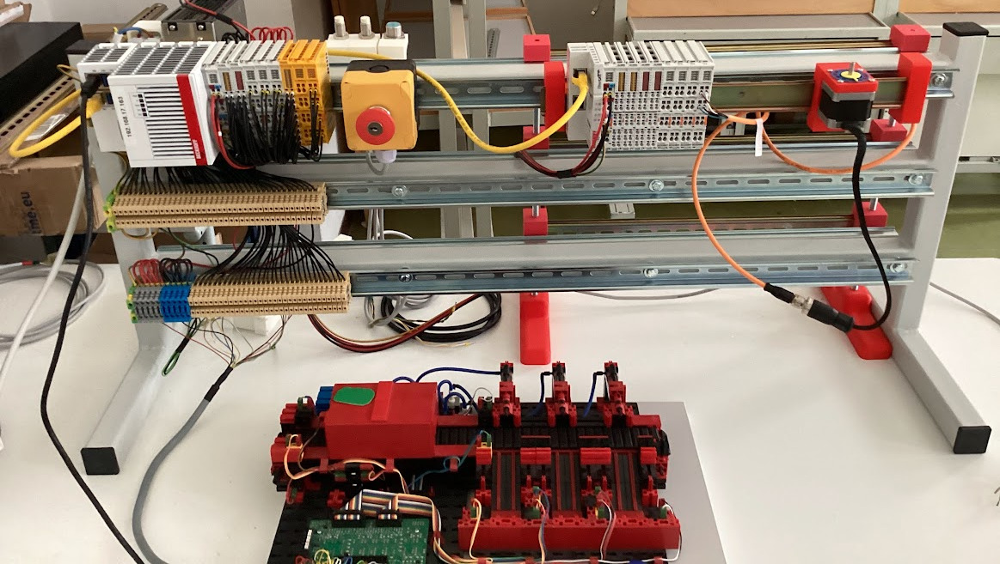

<!-- _class: titlepage titlepagev2 -->

# ANNO DI    FORMAZIONE E PROVA 2022/23

## Docente neoassunto: **Flavio Barisi**
## Docente tutor: **Pietro Piol**

---

<!-- _class: summarypage -->

# Sommario

- [Introduzione](#introduzione)
- [Descrizione Hardware](#descrizione-hardware)
- [Lo standard IEC 61131](#lo-standard-iec-61131)
- [Installazione di TwinCAT](#installazione-di-twincat)

---

<!-- _class: sectionpage -->

# Didattica

---

# Attività didattica

- Anno di prova iniziato il 1/9/2022
- 764 ore di lezione
  - 22 ore settimanali
  - 3 classi disciplina **Tecnologie informatiche**
  - 3 classi disciplina **Sistemi automatici**
- 6,5 ore di scuola aperta e laboratori
- 12 ore laboratori formativi anno di prova

---

# Classi e incarichi aggiuntivi

- **1I**: 3 ore di cui 2 con ITP, 25 alunni
- **1L**: 3 ore di cui 2 con ITP, 25 alunni
- **1M**: 3 ore di cui 2 con ITP, 25 alunni
- **3AET**: 4 ore di cui 2 con ITP, 25 alunni
  - Tutor PCTO
- **3CET**: 4 ore di cui 2 con ITP, 25 alunni
- **4CET**: 5 ore di cui 3 con ITP, 25 alunni
  - Segretario del consiglio di classe

---

<!-- _class: sectionpage -->

# Bilancio iniziale delle competenze

---

# Punti di forza

- Padronanza della disciplina

- Progettare attività per la verifica delle competenze trasversali (soft skills)

- Costruire e condividere con la classe regole chiare

---

# Punti di debolezza

- Utilizzare efficacemente le tecnologie digitali per migliorare la propria professionalità

- Rendere gli studenti consapevoli dei loro progressi rispetto agli obiettivi di apprendimento

- Progettare le attività della classe, affinché queste tengano conto delle necessità degli allievi con bisogni speciali in modo da favorirne l’integrazione

---

# Patto per lo sviluppo professionale

Di seguito sono riportati  gli elementi del Patto per lo Sviluppo Professionale che ho adottato per affrontare e superare i punti di debolezza identificati:

- Conoscere gli elementi epistemologici delle discipline e strutturare le conoscenze  intorno ai principi fondanti delle discipline
- Essere capace di sviluppare collegamenti interdisciplinari
- Stabilire una proficua relazione con i propri allievi favorendo un clima di classe positivo
- Istituire rapporti efficaci e corretti con le famiglie

---

<!-- _class: sectionpage -->

# Attività didattica predisposta

---

# Quadro di automazione

- Dispositivi di protezione elettrica
- Alimentatore
- PC Industriale CX9020
- Dispositivi I/O analogici e digitali
- Motore passo passo AS1010-0000
  

---

# Visita ISIS Bassa Friulana

Su suggerimento dei tecnici Beckhoff, e previo accordo con il prof. Luca D'Amore ho effettuato una visita presso l'ISIS Bassa Friulana di Cervignano al fine di trarre ispirazione dai materiali didattici preparati:

- Utilizzo di kit per l'automazione Fischertechnik
- Interfacciamento con braccio robotico Comau
- Interfacciamento con database ed interfacce utente avanzate
- Collaborazioni con l'industria
---

# Quadro didattico ISIS Bassa Friulana

---

# Corso Beckhoff

Durante il mese di giugno ho seguito corso online offerto da Beckhoff della durata di 16 ore: 

- TwinCAT 3 Formazione Base                                                  
- TwinCAT 3 Programmazione PLC Base
- TwinCAT 3 Motion NC PTP Base 
- TwinCAT 3 Programmazione PLC – Estensioni OOP

---

# Visita Savio

---

<!-- _class: sectionpage -->

# Bilancio finale

---

# Competenze approfondite

Gestione della classe: Ho lavorato per migliorare la mia capacità di creare un ambiente di
apprendimento inclusivo, positivo e ben organizzato. Questa competenza è migliorata
grazie alla partecipazione a workshop e seminari, all'osservazione di colleghi esperti e alla
sperimentazione di diverse strategie in classe. Uso di strumenti e tecnologie digitali: Ho
approfondito le mie conoscenze e abilità nell'utilizzo di strumenti digitali per migliorare
l'insegnamento e l'apprendimento. Grazie all'attività di formazione e alla pratica in classe,
mi sento più a mio agio nell'integrare le tecnologie nella didattica e nel monitoraggio del
progresso degli studenti. Approcci pedagogici innovativi: Ho cercato di acquisire una
maggiore padronanza di metodi didattici innovativi, come il cooperative learning, la flipped
classroom e la gamification. La partecipazione a corsi di formazione e la condivisione delle
esperienze con i colleghi mi ha permesso di applicare questi approcci in classe,
migliorando l'engagement degli studenti e la qualità dell'apprendimento. Competenze
comunicative e relazionali: Ho lavorato per migliorare le mie capacità di comunicazione e
le relazioni con gli studenti, i genitori e i colleghi. Attraverso la pratica quotidiana, la
riflessione sulle mie interazioni e il feedback ricevuto, ho notato miglioramenti nella mia
capacità di ascoltare, comunicare in modo efficace e costruire relazioni positive.

---

<!-- _class: thankspage -->
