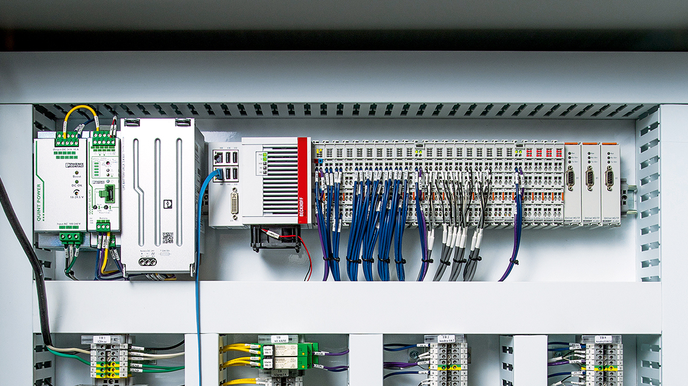

<!-- _class: titlepage -->

# SISTEMI DI AUTOMAZIONE BECKHOFF

Corso base per docenti 2023

---

<!-- _class: summarypage -->

# Sommario

- [Introduzione](#introduzione)
- [Prerequisiti](#prerequisiti)
- [Obiettivi formativi](#obiettivi-formativi)
- [Struttura del corso](#struttura-del-corso)

---

<!-- _class: sectionpage -->

# Introduzione

---

# Beckhoff

- La multinazionale Beckhoff realizza sistemi di automazione con tecnologia di controllo basata su PC. 
- La gamma di prodotti copre i principali settori dell'industria come PC industriali, componenti per bus di campo e I/O, Motion Control e software di automazione.
- Un elemento chiave della tecnologia di controllo PC-based di Beckhoff è il software di automazione TwinCAT (che sta per “The Windows Control and Automation Technology”), in grado di trasformare quasi qualsiasi sistema basato su PC in un sistema di controllo real-time, con un tempo di ciclo fino a 100 microsecondi. 

---

# Beckhoff in breve

- Fatturato globale 2022: 1.515 miliardi di euro (+28%)
- Sede centrale: Verl, Germania
- Titolare e amministratore: Hans Beckhoff
- Collaboratori nel mondo: 5.680
- Ingegneri: 2.200
- Filiali nel mondo: 40
- Uffici vendita in Germania: 24
- Rappresentanze nel mondo: > 75

---

# Sedi Beckhoff

--- 

# Esempio quadro automazione

---

# Quadro didattico ISIS Cervignano

---

<!-- _class: sectionpage -->

# Prerequisiti

---

# Prerequisiti

- Conoscenza di base di programmazione
- Familiarità con il concetto di automazione industriale
- Comprensione dei sistemi di controllo a logica sequenziale
- Conoscenza degli elementi di un PLC (Programmable Logic Controller)
- Linguaggi di programmazione standard IEC 61131-3
- Conoscenza di base dei sistemi operativi Windows
- Comprensione dei concetti di rete e protocolli di comunicazione

---