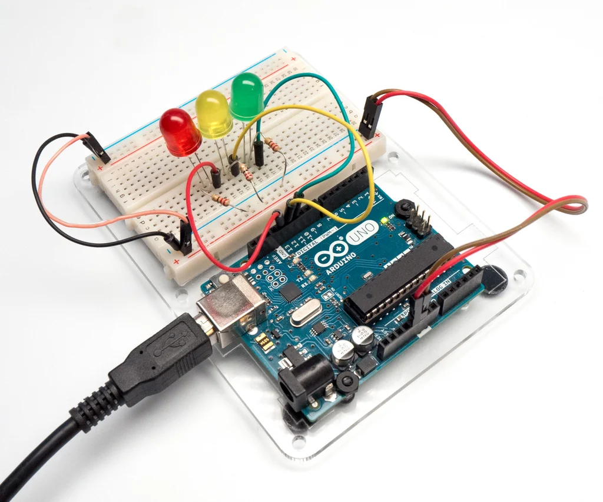
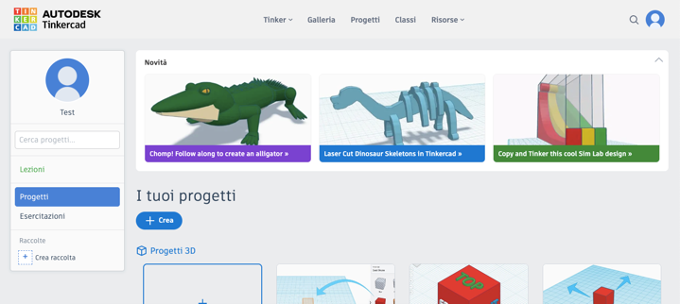
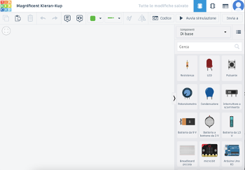
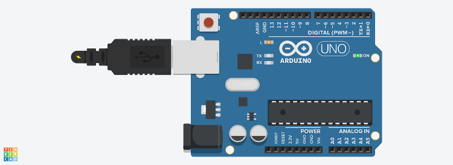
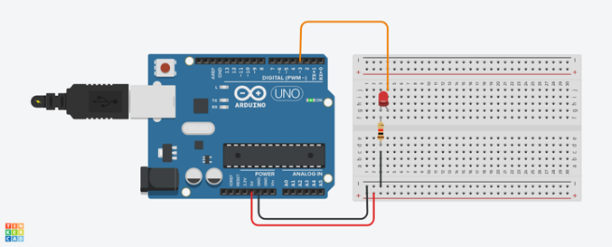
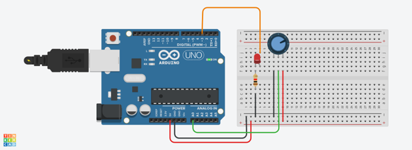
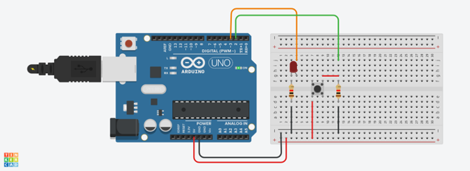
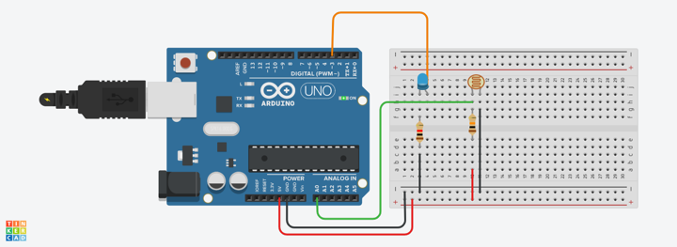

<!-- _class: titlepage -->



<div class="shape"></div>
<div class="spacer"></div>

# TECNOLOGIE INFORMATICHE

Classi 1°

## Arduino

<div class="spacer"></div>

Prof. Flavio Barisi - Anno scolastico 2022/23

---

<!-- _class: summarypage -->

# Sommario

- [Tinkercad](#thinkercad)
- [Lampeggio LED integrato](#lampeggio-led-integrato)
- [Lampeggio LED esterno](#lampeggio-led-esterno)
- [Accensione LED graduale con potenziometro](#accensione-led-graduale-con-potenziometro)
- [Accensione LED con pulsante](#accensione-led-con-pulsante)
- [Fotoresistore](#fotoresistore)

---

<!-- _class: sectionpage -->

# Thinkercad
---

# Introduzione

Tinkercad è un programma di modellazione 3D e di
simulazione di circuiti elettronici creato da Autodesk. Per accedere:

- Navigare verso il sito [Tinkercad](https://www.tinkercad.com)
- Selezionare il pulsante **Accedi**
- Selezionare **Studenti con codice della lezione**
- Inserire il codice della lezione fornito dal docente
- Inserire il proprio nickname comunicato dal docente

---

# Panoramica



--- 

# Creazione di un nuovo progetto

<div class="columns">
  <div>

  - Premere il pulsante **Crea** 
  - Selezionare **Circuito**
  - Per aggiungere un componente, fare click sul componente e posizionarlo nel layout del progetto a sinistra
 
  </div>
  <div>

  
  </div>
</div>

---

<!-- _class: sectionpage -->

# Lampeggio LED integrato

---

# Istruzioni


- Aggiungere al progetto un componente **Arduino Uno R3**
- Premere il pulsante **Codice** in alto a destra. 
- Scegliere dal menù a discesa la voce **Testo**
- Non è necessario modificare il codice proposto
- Premere il pulsante **Avvia simulazione**. Si può notare il LED chiamato **L** lampeggiare, restando acceso per un secondo e spento per un altro secondo.

---


# Schema Elettrico



---

# Variazioni

<div class="columns">
<div>

- Modificare il codice di Arduino con il seguente frammento. Cosa cambia?
- Provare a modificare il programma per ottenere un risultato diverso.

</div>
<div>

```cpp
void setup()
{
  pinMode(LED_BUILTIN, OUTPUT);
}

void loop()
{
  digitalWrite(LED_BUILTIN, HIGH);
  delay(2000); // Wait for 2000 millisecond(s)
  digitalWrite(LED_BUILTIN, LOW);
  delay(2000); // Wait for 2000 millisecond(s)
}
```

</div>
</div>

---

<!-- _class: sectionpage -->

# Lampeggio LED esterno

---

<!-- _class: small -->

# Istruzioni

- Aggiungere al progetto un componente **Arduino Uno R3**
- Aggiungere al progetto una **breadboard piccola**, un **resistore** dal valore di 220 Ω ed un LED seguendo lo schema elettrico.
- Effettuare i collegamenti seguendo lo schema elettrico e rispettando
l'orientamento del LED.
- Premere il pulsante **Codice** in alto a destra.
- Scegliere dal menù a discesa la voce Testo
- Modificare il codice secondo quanto riportato nelle slide successive
- Premere il pulsante Avvia simulazione. Si può notare il LED esterno lampeggiare, restando acceso per un secondo e spento per un altro secondo.

---


# Schema Elettrico



---


# Codice

```cpp
void setup()
{
  pinMode(3, OUTPUT);
}

void loop()
{
  digitalWrite(3, HIGH);
  delay(1000); // Wait for 1000 millisecond(s)
  digitalWrite(3, LOW);
  delay(1000); // Wait for 1000 millisecond(s)
}
```
---


# Variazioni

<div class="columns">
<div>

- Collegare un secondo LED alla porta 4. Modificare il codice di Arduino con il seguente frammento. Cosa cambia?
- Provare a modificare il circuito ed il programma per realizare un semaforo.
</div>
<div>

```cpp
void setup()
{
  pinMode(3, OUTPUT);
  pinMode(4, OUTPUT);
}
void loop()
{
  digitalWrite(3, HIGH);
  digitalWrite(4, LOW);
  delay(1000); // Wait for 1000 millisecond(s)
  digitalWrite(3, LOW);
  digitalWrite(4, HIGH);
  delay(1000); // Wait for 1000 millisecond(s)
}
```

</div>
</div>

---

<!-- _class: sectionpage -->

# Accensione LED graduale con potenziometro

---

<!-- _class: small -->

# Istruzioni

- Aggiungere al progetto un componente Arduino Uno R3
- Aggiungere al progetto una breadboard piccola, una resistenza dal
valore di 220 Ω, un LED ed un potenziometro seguendo lo schema
elettrico.
- Effettuare i collegamenti seguendo lo schema elettrico e rispettando
l'orientamento del LED.
- Premere il pulsante Codice in alto a destra.
- Scegliere dal menù a discesa la voce Testo e modificare il codice secondo quanto riportato nelle slide successive
- Premere il pulsante Avvia simulazione. Si può notare il LED esterno
diventare più o meno luminoso a seconda della rotazione del
potenziometro

---

# Schema Elettrico



---

# Codice

```cpp
#define pinLed 3
#define pinPot A0

void setup()
{
  pinMode(pinLed, OUTPUT);
  pinMode(pinPot, INPUT);
}

void loop()
{
  // analogRead value is between 0-1023
  byte value = analogRead(pinPot)/4;
  // analogWrite value is between 0-255
  analogWrite(pinLed, value);
  delay(10);
}
```
---

<!-- _class: sectionpage -->

# Accensione LED con pulsante

---

<!-- _class: small -->

# Istruzioni

- Aggiungere al progetto un componente Arduino Uno R3
- Aggiungere al progetto una breadboard piccola, una resistenza dal valore di 220 Ω, un LED, un pulsante ed un'altra resistenza da 10 kΩ (chiamata di pull-down) seguendo lo schema elettrico.
- Effettuare i collegamenti seguendo lo schema elettrico e rispettando l'orientamento del LED. 
- Premere il pulsante Codice in alto a destra. 
- Scegliere dal menù a discesa la voce Testo
- Modificare il codice secondo quanto riportato nelle slide successive
- Premere il pulsante Avvia simulazione. Si può notare il LED esterno si accende quando il tasto è premuto e si spegne quando il tasto non è premuto.

---


# Schema Elettrico



---

# Codice


```cpp
#define pinLed 3
#define pinButt 2

void setup() {
  pinMode(pinLed, OUTPUT);
  pinMode(pinButt, INPUT);
}
void loop() {
  bool buttonValue = digitalRead(pinButt);
  if (buttonValue) {
    digitalWrite(pinLed, HIGH );
  }
  else {
    digitalWrite(pinLed, LOW );
  }
  delay(100); // Wait for 100 millisecond(s)
}
```
---

# Variazioni

<div class="columns">
<div>

- Verificare che il
frammento di codice
accanto porta allo stesso
risultato. Perché?
</div>
<div>

```cpp
#define pinLed 3
#define pinButt 2

void setup() {
  pinMode(pinLed, OUTPUT);
  pinMode(pinButt, INPUT);
}

void loop() {
  digitalWrite(pinLed, digitalRead(pinButt));
  delay(100); // Wait for 100 millisecond(s)
}
```

</div>
</div>

---

<!-- _class: sectionpage -->

# Fotoresistore

---

# Istruzioni

<!-- _class: small -->

- Aggiungere al progetto un componente Arduino Uno R3
- Aggiungere al progetto una breadboard piccola, una resistenza dal valore di 220 Ω, un LED, un fotoresistore ed un'altra resistenza da 10 kΩ seguendo lo schema elettrico.
- Effettuare i collegamenti seguendo lo schema elettrico e rispettando l'orientamento del LED. 
- Premere il pulsante Codice in alto a destra. 
- Scegliere dal menù a discesa la voce Testo
- Modificare il codice secondo quanto riportato nelle slide successive
- Premere il pulsante Avvia simulazione. Si può notare il LED esterno diventare più o meno luminoso a seconda della luminosità rilevata dal fotoresistore (modificabile anch'essa con un cursore apposito)

---

# Schema Elettrico



---

# Codice

```cpp
#define pinLed 3
#define pinFoto A0

void setup() {
  pinMode(pinLed, OUTPUT);
  pinMode(pinFoto, INPUT);
}

void loop() {
  analogWrite(pinLed,(analogRead(pinFoto)/4));
  delay(100);
}
```
---

<!-- _class: sectionpage -->

# Approfondimenti

---

# RGB LEDs

[](https://www.youtube.com/watch?v=YqHkULDmmGU "RGB LEDs With Arduino in Tinkercad")
