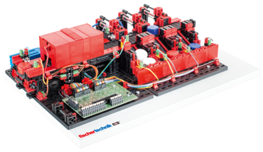
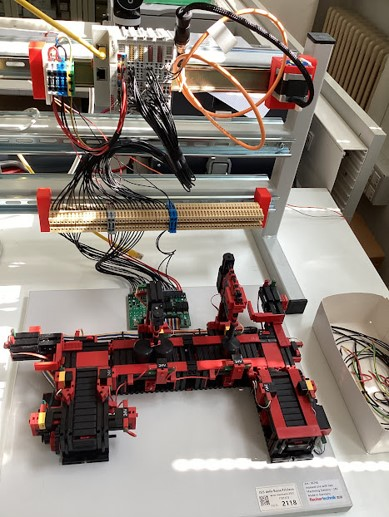

<!-- _class: titlepage -->

# BECKHOFF PC AUTOMATION

## Sviluppi futuri

---

<!-- _class: summarypage -->

# Sommario

- [Quadri per automazione](#quadri-per-automazione)
- [Quadri didattici](#quadri-didattici)

---

<!-- _class: sectionpage -->

# Quadri per automazione

---

# Fischertechnik

- Vasta gamma di dispositivi a 24 V utilizzabili per l’automazione industriale in ambito didattico
- Relativamente economici e semplici da utilizzare
- Tutti i dispositivi: https://www.fischertechnik.biz/24-v-for-use-with-plc-2

---

<!-- _class: small -->

# Fischertechnik

- Indexed Line with 2 Machining Stations 24v
- U-shaped conveyor line. Features a milling and a drilling station, and four conveyor belt sections. Fully assembled training model for use with PLC (Programmable Logic Controllers) and PLC programming software.
- MFR Part #: 96790
- 1,019.44 €
  

---

<!-- _class: small -->

# Fischertechnik

- Sorting Line with Color Detection 24v
- System for detecting workpieces of different colors and sorting them via a conveyor belt into three different storage bins. Fully assembled training model for use with PLC (Programable Logic Controllers) and PLC programming software.
- MFR Part #: 536633
- 947.26 €

---

<!-- _class: small -->

# Fischertechnik

- 3D-Robot 24v
- 3-axis robot with gripping forceps. Robot quickly and precisely positions workpieces in three -dimensional space. Fully assembled training model for use with PLC (Programable Logic Controllers) and PLC programming software.
- MFR Part #: 511938
- 902.15 €

---

# Esempio quadro per automazione

---

# Esempio interfaccia Fischertechnik

---

# Esempio interfaccia Fischertechnik

---

# Braccio robotico Comau

- Comunicazione tramite adattatore protocollo Ethercat – Comau
- Utilizzo di protocolli di comunicazione OPC UA https://www.beckhoff.com/it-it/products/automation/opc-ua/

---

# Braccio robotico Comau

---

<!-- _class: sectionpage -->

# Quadri didattici

---

# Quadri didattici

- Creazione di 10 quadri didattici (uno ogni 2 studenti) facilmente trasportabili e utilizzabili sul proprio banco.
- Contengono un PC industriale Beckhoff e moduli di input/output digitale e analogico

---

# Sicurezza elettrica quadri didattici

- Alimentazione a 24 V esterna tramite alimentatore a doppio isolamento.
- Interfacce di input/output a bassissima tensione di sicurezza raggiungibili da morsettiera esterna

---

# Esempi

---

# Esempi

