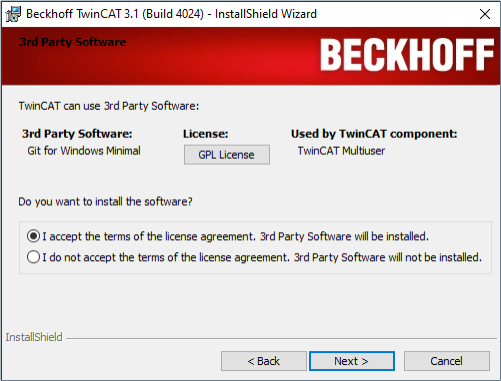
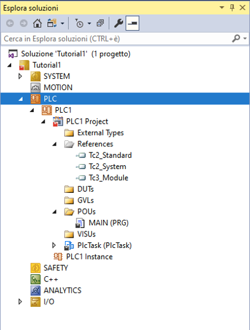
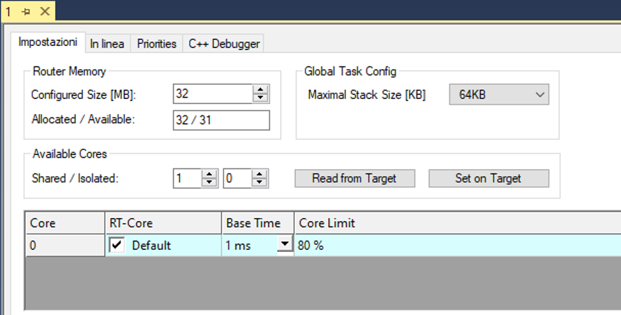
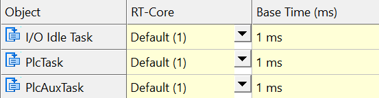
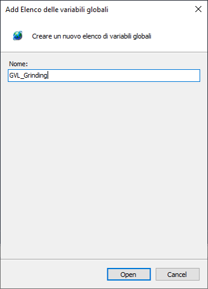
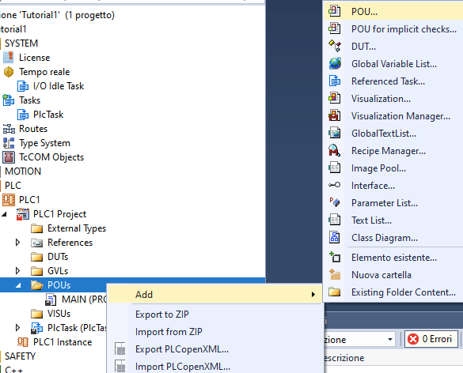
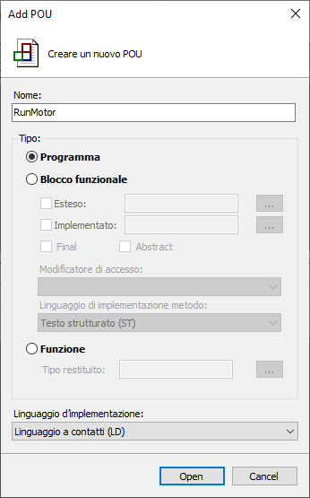
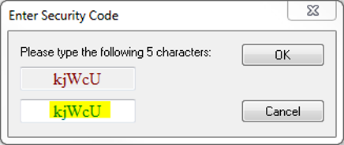

<!-- _class: titlepage -->

# SISTEMI AUTOMATICI

Classi 4° e 5°

## Sistemi di automazione Beckhoff: introduzione

Prof. Flavio Barisi - Anno scolastico 2022/23

---

<!-- _class: summarypage -->

# Sommario

- [I PLC](#i-plc)
- [Beckhoff](#beckhoff)
- [Installazione di TwinCAT](#installazione-di-twincat)
- [Creazione di un progetto](#creazione-di-un-progetto)
- [Collegamento ad un dispositivo remoto](#collegamento-ad-un-dispositivo-remoto)

---

<!-- _class: sectionpage -->

# I PLC

---

# Cos'è un PLC

- Un PLC (Programmable Logic Controller) è in sistema elettronico a funzionamento digitale, destinato all’uso in ambito industriale, che utilizza una memoria programmabile per l’archiviazione interna di istruzioni orientate all’utilizzatore per l’implementazione di funzioni specifiche […] e per controllare, mediante ingressi e uscite sia digitali sia analogiche, vari tipi di macchine e processi (IEC 61131)

- Il PLC presenta molti vantaggi rispetto alla logica cablata realizzata con componenti elettromeccanici e pneumatici:
  - Possibilità di essere riprogrammati
  - Modularità e facilità di espansione
  - Assenza di parti meccaniche in movimento (relè) 

---

# Applicazioni

Gli ambiti in cui i PLC trovano impiego sono molteplici e includono:

- Controllo di macchine industriali e macchine utensili
- Movimentazione di materiale nei cicli produttivi
- Assemblaggio di componenti
- Realizzazione e trattamento di materiali plastici
- Controllo dei robot industriali

---

# Funzionamento dei PLC

Il PLC funziona attraverso una scansione continua del programma costituita da tre passaggi:

- Gli ingressi vengono acquisiti e copiati in una regione della RAM denominata **immagine di processo degli ingressi**
- Il programma viene eseguito operando sulle variabili contenute nella RAM, ed in particolare leggendo l'**immagine di processo degli ingressi** e scrivendo l'**immagine di processo degli uscite**
- Vengono scritti sulle uscite fisiche i valori contenuti all'interno dell'**immagine di processo degli uscite**

---

<!-- _class: sectionpage -->

# Beckhoff

---

# Beckhoff

- La multinazionale Beckhoff realizza sistemi di automazione basati su PC industriali. 
- Un elemento chiave della tecnologia di controllo PC-based di Beckhoff è il software di automazione TwinCAT (che sta per “The Windows Control and Automation Technology”), in grado di trasformare quasi qualsiasi sistema basato su PC in un sistema di controllo real-time, con un tempo di ciclo fino a 100 microsecondi, ovvero quello che viene denominato SoftPLC. 

---

# Beckhoff in breve

- Fatturato globale 2022: 1.515 miliardi di euro (+28%)
- Sede centrale: Verl, Germania
- Titolare e amministratore: Hans Beckhoff
- Collaboratori nel mondo: 5.680
- Ingegneri: 2.200
- Filiali nel mondo: 40
- Uffici vendita in Germania: 24
- Rappresentanze nel mondo: > 75

---

# Sedi Beckhoff

--- 

# TwinCAT 3

- I sistemi operativi Windows  non hanno caratteristiche realtime, ovvero non sono stati progettati per gestire task di controllo. I vari task possono essere interrotti durante la loro esecuzione da una serie di altri eventi oppure essere  ritardati a causa di interruzioni dovute ad altri task con priorità maggiore.
- TwinCAT 3 contiene un'estensione a livello del kernel di Windows che permette di operare in modo deterministico ed in **realtime** con un jitter (variazione rispetto alla caratteristica attesa) massimo inferiore a 12 μs. Nel resto della presentazione si farà riferimento a TwinCAT 3 con il nome **TwinCAT**.

---

# Struttura di TwinCAT

- **TwinCAT XAE** (eXtended Automation Engineering) è un ambiente di sviluppo basato su Microsoft Visual Studio. Permette di sviluppare il software nei linguaggi di programmazione IEC 61131-3, in C/C++ e  MATLAB®/Simulink®. Il tool offre inoltre funzionalità di debug e diagnostica e può essere facilmente esteso per includere ulteriori moduli software.
- **TwinCAT XAR** (eXtended Automation Runtime) è un ambiente con capacità di calcolo in tempo reale in cui il programma può essere eseguito. La sua architettura modulare rende possibile installare e caricare estensioni su richiesta. Il Runtime viene eseguito a basso livello, insieme al Sistema Operativo.

---

# Struttura di TwinCAT

---

# EtherCAT

- EtherCAT (Ethernet for Control Automation Technology) è una tecnologia Ethernet industriale deterministica (real-time) sviluppata originariamente da Beckhoff Automation. Il protocollo EtherCA è stato pubblicato nello standard IEC 61158 (Reti di comunicazione industriale).
- Il master EtherCAT invia un telegramma che attraversa tutti i nodi. Ogni slave EtherCAT legge i dati di uscita ad esso destinati e scrive quelli da esso prodotti nel frame “al volo”, mentre quest’ultimo si propaga verso i nodi successivi. Il ritardo subito dal frame è pari al solo tempo di attraversamento fisico dello slave. L’ultimo nodo in un segmento o linea di caduta rinvia il messaggio al master avvalendosi della comunicazione full-duplex di Ethernet.

---

# Ethercat

---

# ADS

- La comunicazione tra moduli software diversi, sia localizzati sullo stesso dispositivo hardware sia su due dispositivi hardware distinti, avviene tramite un protocollo definito da Beckhoff ma aperto, denominato ADS (Automation Device Specification)
- **ADS Server**: è tipicamente rappresentato da un componente del TwinCAT kernel, che esegue task Real-Time; 
- **ADS Client**: è generalmente un applicativo Windows che accede ai dati Real-Time di un ADS Server per configurazione, programmazione o supervisione

---

# ADS

---

<!-- _class: sectionpage -->

# Installazione di TwinCAT

---

# Requisiti di Sistema

- Sistema operativo: Windows 7 o superiore
- CPU: 1.8 GHZ o superiore con almeno 2 Core (raccomandato Intel)
- RAM: 4 GB
- Spazio su disco: almeno 10 GB
- Intel Virtualization Technology (VT-x) abilitato e Hyper-Threading disabilitato

---

# Tipi di installazione

- **Installazione standard**: viene installata la Shell XAE basata su Visual Studio 2017 e comprende tutte le funzioni di base:
  - gestire la logica nei linguaggi di programmazione IEC 61131-3 inclusa l'estensione Object Oriented
  - gestire il moduli di sicurezza, motion control, reti
  - utilizzare moduli esistenti esistenti C/C++ e Matlab Simulink 

- **Installazione integrata**: TwinCAT viene integrato all'interno di una installazione di Visual Studio preesistente. Permette di scrivere moduli in linguaggio C++, Matlab Simulink, e applicazioni non realtime in C#/.NET

---

# Installazione Integrata

- Il primo passo dell'installazione integrata è l'installazione di Visual Studio 2019. La versione ufficialmente supportata è la Professional,ma è possibile usare anche la versione Community con alcune limitazioni.
- Visitare il sito https://visualstudio.microsoft.com/it/vs/older-downloads/ e scaricare Visual Studio 2019 Community Edition. 
Effettuare un doppio click sul file e seguire le istruzioni a video. Selezionare i carichi di lavoro per applicazioni Desktop C++ e C#/.NET
---

# Installazione Visual Studio 2019

 

---

# Installazione TwinCAT 3

- Visitare il sito https://www.beckhoff.com/it-it/support/download-finder/software-and-tools/ e registrarsi con un indirizzo email valido
- Scaricare il file eseguibile chiamato eXtended Automation Engineering (XAE) della dimensione 1,4 GB (il file XAE include anche la parte XAR descritta in precedenza)
- Effettuare un doppio click sul file e seguire le istruzioni a video. Selezionare le opzioni visualizzate nelle slide seguenti
- Se si è scelto di seguire la modalità di installazione integrata, selezionare la versione di Visual Studio da estendere. In caso di installazione standard, usare le impostazioni di default

---

#  Installazione TwinCAT 3

  

  

  

  

  
  

---

#  Installazione TwinCAT 3

  

  

  

  
  

  
  

---
# Post installazione

- Se il sistema operativo è Windows 8 o superiore, sarà necessario eseguire uno script al termine dell'installazione.
- Posizionarsi nel percorso C:\TwinCAT\3.1\System
- Fare click con il tasto destro del mouse sul file **win8settick**
- Selezionare **Esegui come amministratore**
- Riavviare il computer

---

# Verifica modulo XAR

- Al termine dell'installazione è possibile verificare il corretto funzionamento di TwinCAT XAR effettuando il passaggio a **Config mode** e **Run mode** ovvero le due modalità operative di funzionamento di TwinCAT.
- Individuare l'icona di TwinCAT nell'area di notifica
- Fare click con il tasto destro del mouse e selezionare **System/Start Restart**
- L'icona diventerà verde

---

# Verifica modulo XAR

  

  
  
  

---

<!-- _class: sectionpage -->

# Uilizzo di TwinCAT

---

# Creazione di un progetto

- Fare click con il tasto destro del mouse sull'icona di TwinCAT nell'area di notifica e selezionare **TwinCAT XAE**. Attendere alcuni minuti l'apertura a seconda della velocità del proprio PC.
- Selezionare File -> Nuovo -> Progetto
- Selezionare TwinCAT Projects e poi TwinCAT XAE project.
- Assegnare un nome al progetto ed alla soluzione (possono coincidere) e premere Ok

---

# Creazione di un progetto

---

<!-- _class: small -->

# Organizzazione progetto

Tutti i file del progetto sono organizzati nel pannello **Esplora soluzioni**. Il nodo principale è la **Soluzione** ovvero un contenitore di progetti di Visual Studio. All'interno del progetto vi è un solo progetto, ma è possibile aggiungere progetto di varia natura, come ad esempio una HMI C#. Sotto il progetto possiamo trovare:

- **System**: Gestisce il runtime, le licenze e i core utilizzati dai processi
- **Motion**: Contiene i task e gli assi di movimento (Es. interfaccia con motori)
- **Safety**: Contiene la logica di sicurezza (Ad esempio interfaccia con il dispositivo EL6900)
- **PLC**: Contiene i progetti PLC con le variabili e le logiche associate
- **C++**: Permette di scrivere codice C++ da eseguire a runtime
- **I/O**: Permette di configurare i dispositivi di Input/Output ed effettuare le associazioni tra il modulo PLC e le varie periferiche

---

# Schermata principale progetto

---

# Creazione di un progetto PLC

In TwinCAT un PLC è in realtà un PLC virtuale. È possibile infatti eseguire più PLC su un singolo computer e separarne l'esecuzione sui singole Core della CPU.
- Fare click con il tasto destro sul nodo PLC nel pannello **Esplora Soluzioni** e selezionare **Aggiungi un nuovo Elemento**.
- Inserire un nome per il progetto (ad esempio PLC 1), selezionare **Progetto PLC Standard** e premere **Aggiungi**

---

# Creazione di un progetto PLC

---

<!-- _class: small -->

# Struttura di un progetto PLC

- **External Types**: cartella usata solo per applicazioni particolari
- **References**: contiene i riferimenti alle librerie esterne, come ad esempio quelle di Motion Control
- **DUTs (Data Unit Type)**: contiene le strutture definite dall'utente
- **GVLs (Global Variable List)**: contiene le liste da variabili globali, ovvero accessibili ovunque all'interno del progetto
- **POUs (Program Organization Unit)**: Contiene la logica del PLC. Ci sono tre tipi di POU: programmi, blocchi funzionali e funzioni. In fase di creazione del progetto viene automaticamente creata una POU chiamata MAIN
- **VISUs (Visualization)**: contiene le schermate di visualizzazione HMI (Human Machine Interface)
- **PLCTask**: Contiene i Task che eseguiranno i codice all'interno del Runtime di TwinCAT. In fase di creazione del progetto viene automaticamente creato un Task per l'esecuzione della POU MAIN

---

# Struttura di un progetto PLC

---

# Task

- Un Task ha degli attributi che possono essere modificati nella sezione **SYSTEM -> Tasks** del pannello **Esplora soluzioni**.
- Un parametro importante è quello denominato **Cycle time** che corrisponde al tempo che intercorre tra due successive esecuzioni del Task espresso a sua volta in multipli di un altro parametro detto **Base Time**
- È possibile modificare il Base Time e il Cycle Time se necessario ma bisogna considerare che la durata della singola esecuzione dev'essere inferiore al Cycle Time

---

# Task

  
  
  

---

# Real-time

- TwinCAT XAR viene eseguito nel modo di esecuzione ring 0 ovvero nel kernel mode, mentre TwinCAT XAE viene eseguito nel modo di esecuzione ring 3, ovvero user mode
- Il runtime registra un interrupt per forzare la sua esecuzione ad intervalli regolari (detto clock). Le routine di interrupt vengono eseguite a kernel mode. Il runtime esegue i Task che a loro volta possono eseguire i programmi PLC, effettuare controllo del movimento, interfacciarsi con le periferiche EtherCAT o comunicare con le HMI.
- Questa routine ha priorità sui programmi in user mode, come ad esempio TwinCAT XAE oppure le HMI

---

# Configurazione real-time

- Per modificare il comportamento real-time di TwinCAT, effettuare un doppio click nella sezione SYSTEM -> Tasks del pannello Esplora soluzioni. 
- Se è la prima volta che si visita questa sezione, premere il pulsante **Read from Target** per leggere la configurazione dal PC corrente
- Se si dispone di una CPU multi-core, è consigliato allocare uno dei core ad uso esclusivo di TwinCAT. Per fare ciò, utilizzare il pulsante **Set on Target** e ridurre di un'unità il numero di Core disponibili per Windows. Dopo il riavvio del PC, sarà possibile selezionare il core di tipo **Isolated**  dalla lista dei core disponibili.
---

# Finestra di configurazione real-time

---

# Read from Target

---

# Set on Target

  
  
  

---

# Configurazione dei Task

  - Una volta definiti i core utilizzati, è possibile associare ciascuno dei processi ad uno specifico core in modo da suddividere il carico
  - In fase di creazione e configurazione del progetto vengono automaticamente creati i Task necessari.
  
  

---

# Descrizione del progetto

- In questo primo progetto, programmeremo una macchina che può essere avviata tramite un pulsante di avvio e arrestata tramite un pulsante di arresto. Lo stato di macchina avviata sarà segnalato tramite l'accensione di un indicatore luminoso.

---

# Creare una GVL

- Una GVL (Global Variable List) contiene variabili accessibili da tutto il progetto PLC.
- Fare click con il tasto destro nella cartella GVLs del progetto PLC nel pannello **Esplora Soluzioni** e selezionare **Add -> Global Variable List**
- Inserire un nome alla GVL, come ad esempio GVL_Grinding
- Fare click sul tasto Apri. La nuova GVL verrà creata e aperta per la modifica.

---

# Creare una GVL

  
  
  

---

<!-- _class: small -->

# Creare una GVL

  - Creare tre variabili di tipo BOOL (possono contenere i valori TRUE o FALSE) come da immagine. 
  - La prima variabile (GrindingWheelMS) rappresenta l'avvio del motore che accende la macchina rettificatrice ed è una variabile di output (%Q*). La macchina resterà in movimento finché questa variabile è TRUE . 
  - Le altre due variabili sono di input (%I*). rappresentano gli input dei pulsanti di start e stop.

  

---

<!-- _class: small -->

# Creare una POU in LD

- Una POU (Program Organization Unit) contiene la logica del PLC .Possiamo notare che una POU chiamata MAIN è già stata creata in fase di creazione del progetto
- Fare click con il tasto destro nella cartella POUs del progetto PLC nel pannello Esplora Soluzioni e selezionare Add -> POU
- Inserire un nome per il programma RunGrindingWheel, selezionare il tipo Programma ed il linguaggio di programmazione Ladder Logic Diagram (LD) chiamato anche Linguaggio a contatti
- Fare click sul tasto Apri. La nuova POU verrà creata e aperta per la modifica.
- La finestra è divisa in due parti: la prima parte permette di dichiarare variabili visibili solo all'interno della POU. La seconda parte è dove verrà inserita la logica Ladder.

---

# Creare una POU in LD

  

  

---

# Scrivere la logica in Ladder 1

- Premere con il tasto destro sulla rung e selezionare Inserire bobina dal menù contestuale, oppure cliccare sul simbolo della bobina nel menù Ladder in alto (se non è presente è possibile aggiungerla cliccando con il tasto destro su una sezione vuota). Al posto dei punti di domanda va inserito il nome della variabile  GVL_Grinding.GrindingWheelMS
- Per inserire il pulsante di start, premere con il tasto destro sulla rung e selezionare Inserire contatto dal menù contestuale. Al posto dei punti di domanda, inserire il nome della variabile GVL_Grinding.StartGrindingWheelPB.

---

# Scrivere la logica in Ladder 2

- Inserire un circuito di ritenuta premendo con il tasto destro sulla rung e selezionare Inserire contatto parallelo (sotto) dal menù contestuale. Al posto dei punti di domanda, inserire il nome della variabile. GVL_Grinding.GrindingWheelMS
- Infine, inserire il pulsante di stop tramite premendo con il tasto destro sulla rung dopo i due rami paralleli e selezionare Inserire contatto negato dal menù contestuale. Al posto dei punti di domanda, inserire il nome della variabile GVL_Grinding.StopGrindingWheelPB

---

# Scrivere la logica in Ladder

---

# Modifica del programma MAIN

- Per poter eseguire la POU RunGrindingWheel ad ogni esecuzione del Task, è necessario modificare il programma MAIN e chiamare la POU RunGrindingWheel
- Fare doppio click su MAIN nella cartella POUs del progetto PLC ed inserire nella parte inferiore il seguente testo: RunGrindingWheel();
- La riga appena scritta è una istruzione scritta in linguaggio ST (Structured Text o Testo Strutturato).

---

<!-- _class: small -->

# Download del programma ed esecuzione

- Compilare il programma facendo click su Compila -> Compila soluzione nella barra dei menù
- Verificare che nella schermata di Output ci sia il messaggio:  **Compilazione: 2 completate o aggiornate, 0 non riuscite, 0 ignorate**
- Una volta compilato correttamente il programma, è necessario lanciare il comando TwinCAT -> Activate Configuration, che si occupa di:
  - Fermare il runtime di TwinCAT 3 runtime (tutti i programmi verranno arrestati ed i dispositivi di I/O spenti)
  - Applicare la configurazione realtime (numero di  core, task, etc.)
  - Copiare il programma compilato sulla runtime (se selezionato Autoboot)
  - Applicare la configurazione di mapping 
  - Riavviare il runtime di TwinCAT  in run mode

---

# Autostart

- Quando viene attivata la configurazione, è possibile selezionare l'opzione **Autostart PLC Boot Projects**. Questa opzione farà sì che il programma venga automaticamente caricato sul PLC in fase di Boot ed avviato.
- Se non viene selezionata la voce, in fase di Login (operazione successiva) verrà chiesto il download del programma. Per mandare in esecuzione il programma sarà poi necessaria un'azione manuale.
- Si consiglia di **non** selezionare l'opzione finché il programma non è pronto per essere utilizzato in un ambiente di Produzione.
- Tale opzione è invece fondamentale in un ambiente di Produzione

---

# Gestione licenza e avvio in Run mode

- Dato che non è stata acquistata alcuna licenza, verrò richiesto di generare una licenza di trial. Questo messaggio comparirà ogni 7 giorni.
- Nella finestra, premere il pulsante Sì ed inserire il captcha

  

- Alla richiesta di riavviare il sistema in Run mode, premere Sì

---

# Esecuzione programma

- Una volta generate le licenze ed attivata correttamente la configurazione, l'icone di TwinCAT nell'area di notifica sarà colorata di verde. 
- Per poter eseguire l'applicazione ed effettuare il debug, bisogna andare Online. Fare click su PLC -> Login oppure facendo click sul simbolo verde con la porta e la freccia . - - Quando viene richiesto di effettuare il download dell'applicazione sul PLC, premere Sì
- Far partire l'applicazione facendo click su PLC -> Start nella barra dei menù oppure usando il tasto verde con il simbolo Play

---

# Modifica delle variabili online

- Una volta online ed avviato il programma, fare doppio click sulla POU RunGrindingWheel per vedere lo stato delle variabili e modificarle.
- Possiamo simulare la pressione del pulsante di start facendo doppio click sul contatto corrispondente (il valore diventa TRUE) e facendo poi click su **PLC -> Scrivi valori** (anche accessibile dalla toolbar in alto). Vedremo la variabile GVL_Grinding.GrindingWheelMS colorarsi di blu (valore TRUE)
- Simuliamo il rilascio del pulsante di start scrivendo un valore FALSE e facendo poi click su **PLC -> Scrivi valori**. Noteremo che la variabile di uscita rimane colorata di blu (valore TRUE).
---

# Modifica delle variabili online

---

# Modifica delle variabili online

- Simuliamo la pressione del pulsante di stop ed il suo rilascio allo stesso modo. Noteremo che la variabile di uscita torna ad essere colorata di bianco (valore FALSE)

---

# Forzatura delle variabili online

- Se proviamo a modificare il valore della variabile GrindingWheelMS, noteremo che il suo valore non cambia. Dopo un tempo di ciclo, questa viene infatti ri-settata al valore ottenuto dall'esecuzione della logica LD
- Se vogliamo modificare il valore in maniera stabile, dobbiamo usare il pulsante **PLC -> Forza i valori**
- Le variabili forzate saranno indicate con una F in un quadratino rosso. Per eliminare la forzatura, va premuto il pulsante **PLC -> Annulla la forzatura per tutti i valori**

---

# Effettuare modifiche online

- TwinCAT supporta modifiche online alla logica dei programmi PLC e alle variabili. Grazie a tale funzionalità è possibile modificare la logica del PLC senza attivare una nuova configurazione quindi senza alcuna interruzione. La nuova logica verrà eseguita al primo ciclo PLC utile.
- Non è possibile modifiche online all'associazione tra il programma PLC e l'I/O fisico. Per aggiungere o rimuovere I/O o modificare l'associazione tra I/O PLC e I/O fisico, utilizzare TwinCAT > Attiva configurazione dal menu principale e riavviare l'esecuzione, che comporterà il riavvio dei programmi PLC e causando un'interruzione del processo.

---

# Effettuare modifiche online

Per apportare una modifica online a un programma PLC:

- Assicurarsi di essere offline (effettuare il logout se si è online).
- Modificare la logica del programma PLC e le variabili.
- Effettuare il login e selezionare **Login con modifica online** quando richiesto.
- Se è stata modificata una variabile (ad esempio, cambiato il tipo), verrà avvertito che la variabile verrà spostata in una nuova posizione di memoria e verrà chiesto se si desidera continuare.
- Mettendo il check su aggiornare il progetto di avvio" se si sceglie "No", le modifiche andranno perse in caso di riavvio dell'esecuzione o del computer

---

<!-- _class: sectionpage -->

# Esecuzione su target remoto

---

# Modalità di connessione

- Per potersi connettere al target remoto è necessario instaurare una connessione di rete tramite un cavo Ethernet.
- Se il PC industriale è configurato per ottenere staticamente un indirizzo IP, è necessario semplicemente creare una rete nello stessa subnet mask e scegliere un indirizzo IP diverso.
- È possibile utilizzare un cavo ethernet non intrecciato (comunemente usato per la connessione da un PC ad uno switch ethernet), dato che le schede di rete moderne implementano una funzione di Auto-MDI/MDIX

---

# Configurazione di rete

<!-- _class: small -->

- Aprire il **Pannello di controllo** di Windows.
- Selezionare **Rete e internet** e successivamente **Visualizza attività e stato della rete**
- Fare click su **Modifica impostazioni scheda**
- Individuare la scheda di rete con cui si vuole effettuare la connessione e fare click con il tasto destro del mouse. Selezionare **Proprietà**
- Selezionare **Protocollo Internet versione 4** e premere su **Proprietà**

---

# Configurazione di rete

<!-- _class: small -->

- L'indirizzo IP del PC industriale CX9020 è 192.0.0.253 con Subnet mask 255.255.0.0
- Inserire dunque la stessa Subnet m ask ed un indirizzo IP compatibile. In pratica, è necessario soltanto che l'indirizzo IP inizi con 192.0. Ad esempio un indirizzo IP valido è 192.0.0.250
- Verificare la connessione aprendo un prompt dei comandi (**cmd**) e usando il comando **ping 192.0.0.250**. Si dovrebbe ottenere il messaggio **Pacchetti: Trasmessi = 4, Ricevuti = 4**

---

# Connessione al PC industriale

- È possibile connettersi al PC industriale per modificarne alcune impostazioni in due modi:
  - tramite applicativo **CERHOST.exe** scaricabile all'indirizzo https://infosys.beckhoff.com/content/1033/cx51x0_hw/Resources/5047075211.zip
  - tramite interfaccia web collegandosi al sito: https://192.0.0.253/config e inserendo il nome utente **Webguest** e password **1**

---

<!-- _class: small -->

# Aggiungere un collegamento

  - Fare click con il tasto destro sull'icona di Twincat nell'area di notifica e selezionare **Router** e poi **Edit routes**
  - Premere il pulsante **Add** ed inserire l'indirizzo IP 192.0.0.253 nel campo vicino al pulsante **Enter Host Name/IP** e premerlo
  - Premere su **Advanced settings** e selezionare **IP address**
  - Premere su **Add Route**. Non è necessario inserire la password. Una x comparirà vicino al campo **Connected**
  - Premere il pulsante **Close** e verificare 

  

  
  
  
  

---

# Aggiungere un collegamento

---

# Aggiungere un collegamento

---

<!-- _class: small -->

# Selezione del Target

- Aprire un progetto TwinCAT. Nel menù a tendina del target sarà comparsa una nuova voce.

- Selezionare il target CX-47C6F4 e premere **Sì** alla richiesta di cambio piattaforma. Il PC CX9020 ha infatti un processore ARM, mentre i normali PC di uso comune hanno architettura X86.

---

# Configurazione Realtime

- Per poter attivare la configurazione sul target remoto, è necessario riconfigurare le impostazioni Realtime per renderle compatibili con il target.
- Effettuare un doppio click nella sezione SYSTEM -> Tasks del pannello Esplora soluzioni. 
- Premere il pulsante **Read from Target** per leggere la configurazione dal Target corrente (in questo caso il PC industriale CX9020)
- Selezionare l'unico core disponibile e lasciare le impostazioni di default

---

# Configurazione Realtime

