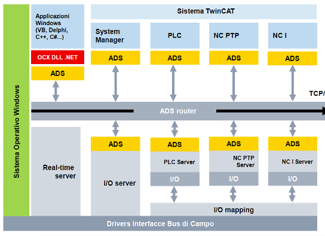
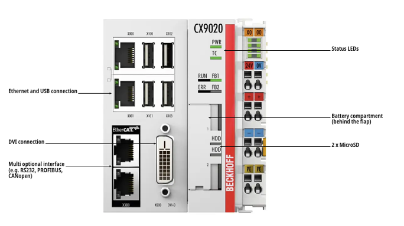
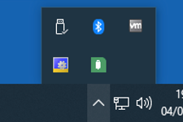
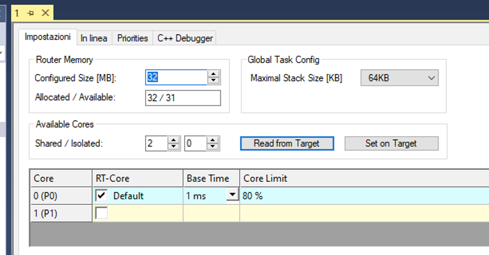
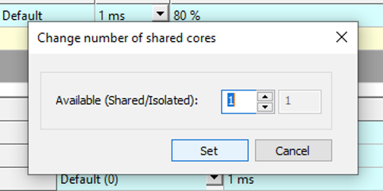
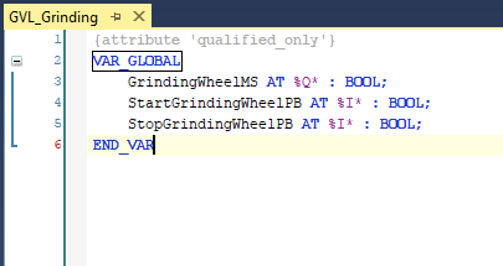
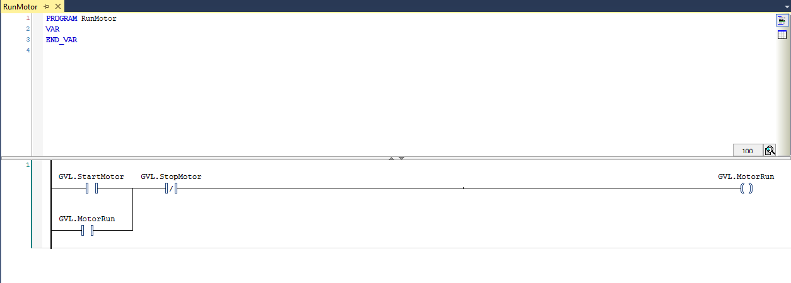
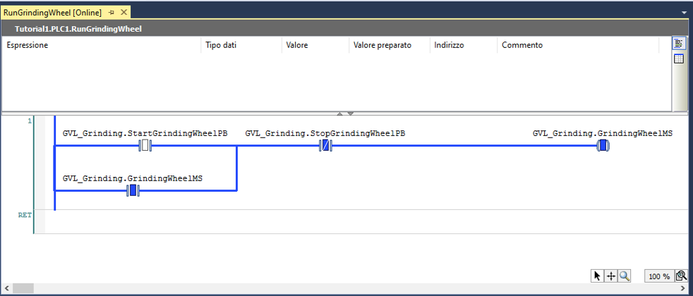

<!-- _class: titlepage -->


<div class="shape"></div>
<div class="spacer"></div>

# SISTEMI AUTOMATICI

Classi 4° e 5°

## Sistemi di automazione Beckhoff: introduzione

<div class="spacer"></div>

Prof. Flavio Barisi - Anno scolastico 2022/23

---

<!-- _class: summarypage -->

# Sommario

- [Introduzione](#introduzione)
- [Descrizione Hardware](#descrizione-hardware)
- [Lo standard IEC 61131](#lo-standard-iec-61131)
- [Installazione di TwinCAT](#installazione-di-twincat)

---

<!-- _class: sectionpage -->

# Introduzione

---

# Beckhoff

- La multinazionale Beckhoff realizza sistemi di automazione con tecnologia di controllo basata su PC. 
- La gamma di prodotti copre i principali settori dell'industria come PC industriali, componenti per bus di campo e I/O, Motion Control e software di automazione.
- Un elemento chiave della tecnologia di controllo PC-based di Beckhoff è il software di automazione TwinCAT (che sta per “The Windows Control and Automation Technology”), in grado di trasformare quasi qualsiasi sistema basato su PC in un sistema di controllo real-time, con un tempo di ciclo fino a 100 microsecondi. 

---

# Beckhoff in breve

- Fatturato globale 2022: 1.515 miliardi di euro (+28%)
- Sede centrale: Verl, Germania
- Titolare e amministratore: Hans Beckhoff
- Collaboratori nel mondo: 5.680
- Ingegneri: 2.200
- Filiali nel mondo: 40
- Uffici vendita in Germania: 24
- Rappresentanze nel mondo: > 75

---

# Sedi Beckhoff


--- 

<!-- _class: small -->

# TwinCAT 3

- I sistemi operativi Windows  non hanno caratteristiche realtime, ovvero non sono stati progettati per gestire task di controllo. La presenza dello scheduler implica che i vari task siano interrotti durante la loro esecuzione da una serie di altri eventi oppure siano ritardati a causa di interruzioni dovute ad altri task con priorità maggiore.
- TwinCAT 3 permette di estendere il sistema operativo con una estensione **realtime** integrata all’interno dell’architettura Microsoft e permette di ottenere l’esecuzione di task in maniera deterministica con un jitter (variazione rispetto alla caratteristica attesa) massimo inferiore a 12 μs. Nel resto della presentazione si farà riferimento a TwinCAT 3 con il nome **TwinCAT**.

---

<!-- _class: small -->

# Struttura di TwinCAT

TwinCAT è diviso in due moduli:
- **Engineering**: TwinCAT XAE (eXtended Automation Engineering) è l'ambiente di sviluppo vero e proprio. Permette di sviluppare il software nei linguaggi di programmazione IEC 61131-3, in C/C++ e  MATLAB®/Simulink®. Il tool offre inoltre funzionalità di debug e diagnostica e può essere facilmente esteso per includere ulteriori moduli software, dato che si basa su Visual Studio di Microsoft.
- **Runtime**: TwinCAT XAR (eXtended Automation Runtime) è un ambiente con capacità di calcolo in tempo reale in cui il programma può essere eseguito. La sua architettura modulare rende possibile installare e caricare estensioni su richiesta. Il Runtime viene eseguito di fianco al sistema operativo, dove ulteriori task possono essere eseguiti. 

---

# Struttura di TwinCAT


---

<!-- _class: small -->

# Ethercat

- EtherCAT (Ethernet for Control Automation Technology) è una tecnologia Ethernet industriale deterministica sviluppata originariamente da Beckhoff Automation. Il protocollo EtherCAT, pubblicato nello standard IEC61158, soddisfa requisiti real-time nell'automazione, in sistemi di test e di misura e in molte altre applicazioni.
- I telegrammi EtherCAT hanno la stessa struttura di un telegramma Ethernet TCP/IP (46÷1500 byte).
- Il master EtherCAT invia un telegramma che attraversa tutti i nodi. Ogni slave EtherCAT legge i dati di uscita ad esso destinati e scrive quelli da esso prodotti nel frame “al volo”, mentre quest’ultimo si propaga verso i nodi successivi. Il ritardo subito dal frame è pari al solo tempo di attraversamento fisico dello slave. L’ultimo nodo in un segmento o linea di caduta rinvia il messaggio al master avvalendosi della comunicazione full-duplex di Ethernet.

---

# Ethercat


---

# ADS

- La comunicazione tra moduli software diversi, sia localizzati sullo stesso dispositivo hardware sia su due dispositivi hardware distinti, avviene tramite un protocollo definito da Beckhoff ma aperto, denominato ADS (Automation Device Specification)
- **ADS Server**: è tipicamente rappresentato da un componente del TwinCAT kernel, che esegue task Real-Time; 
- **ADS Client**: è generalmente un applicativo Windows che accede ai dati Real-Time di un ADS Server per configurazione, programmazione o supervisione

---

# ADS



---

<!-- _class: sectionpage -->

# Descrizione hardware

---

# CX9020 | Basic CPU module



---

<!-- _class: small -->

# EL1008 | 8-channel digital input

<div class="columns">
  <div>

  - EL1008 è un terminale EtherCAT a 8 canali che acquisisce segnali di controllo binario a 24 V dal livello di processo.
  - Caratteristiche elettriche:
    - 24 V DC (-15 %/+20 %)
    - "0" signal voltage	-3…+5 V
    - "1" signal voltage	11…30 V
    - Corrente di input 3 mA
  </div>
  <div>

  
  </div>
</div>

---

<!-- _class: small -->

# EL2008 | 8-channel digital output

<div class="columns">
  <div>

  - EL2008 è un terminale EtherCAT a 8 canali che connette i segnali binari di permette di connettere segnali di controllo a 24 V DC con gli attuatori.
  - Caratteristiche elettriche:
    - 24 V DC (-15 %/+20 %)
    - Corrente massima di output 500 mA
  </div>
  <div>

  
  </div>
</div>

---

<!-- _class: sectionpage -->

# Lo standard IEC 61131

---

# Lo standard IEC 61131

- Lo standard IEC 61131 è uno standard internazionale per la programmazione dei controllori logici programmabili (PLC).
- La sezione 3 dello standard IEC 61131 definisce cinque linguaggi di programmazione comuni utilizzati nell'automazione industriale. Questi linguaggi offrono un'ampia gamma di funzionalità per soddisfare le esigenze di programmazione dei PLC.
- La scelta del linguaggio IEC 61131 dipende dalle esigenze specifiche dell'applicazione in quanto ogni linguaggio ha vantaggi e limitazioni. È possibile utilizzare più linguaggi all'interno di uno stesso progetto per sfruttare al meglio le loro caratteristiche.

---

<!-- _class: small -->

# I cinque linguaggi IEC 61131-3

1. **Ladder Diagram (LD)**: Basato su diagrammi a contatti e bobine, simula il funzionamento di un circuito elettrico. Utilizzato principalmente per controlli sequenziali.
2. **Structured Text (ST)** Linguaggio di programmazione di alto livello simile al Pascal o al C. Consente l'implementazione di algoritmi complessi.
3. **Function Block Diagram (FBD)** Basato sulla rappresentazione grafica di blocchi funzionali interconnessi. Utilizzato per la programmazione di controlli logici complessi.
4. **Instruction List (IL)** Linguaggio di basso livello simile all'Assembly Utilizzato per programmi semplici e ottimizzati.
5. **Sequential Function Chart (SFC)** Linguaggio basato su grafici di stato e diagrammi di flusso. Utilizzato per il controllo di macchine e processi complessi.
---

# Variabili

- Le variabili sono elementi fondamentali nella programmazione PLC. Sono dei contenitori dove i dati vengono memorizzati e manipolati all'interno di un programma.
- Le variabili possono essere utilizzate per conservare valori temporanei, risultati intermedi o dati di input/output.
- Nel contesto dello standard IEC 61131, esistono numerosi Data Type disponibili per le variabili. I Data Type definiscono il tipo di dato che una variabile può contenere e le operazioni che possono essere eseguite su di essa.

---


<!-- _class: small -->

# Data Type dello standard IEC 61131

| | |
| --------------- | -------------------------------------- |
| **BOOL**            | Tipo booleano (1 bit, vero o falso)           |
| **BYTE**            | Tipo di dato intero a 8 bit [0..255]    |
| **WORD**            | Tipo di dato intero a 16 bit [0..65535]          |
| **DWORD**           | Tipo di dato intero a 32 bit [0..4294967295]          |
| **LWORD**           | Tipo di dato intero a 64 bit [0..2<sup>64</sup>-1]          |           |
| **SINT**            | Tipo di dato intero con segno a 8 bit [-128..127] |
| **INT**             | Tipo di dato intero con segno a 16 bit [-32768..32767] |
| **DINT**            | Tipo di dato intero con segno a 32 bit [-2147483648..2147483647] |
| **LINT**            | Tipo di dato intero con segno a 64 bit [-2<sup>63</sup>..2<sup>63</sup>-1]|
| **USINT**           | Tipo di dato intero senza segno a 8 bit [0..255] |

---

<!-- _class: small -->

# Data Type dello standard IEC 61131

| | |
| --------------- | -------------------------------------- |
| **UINT**            | Tipo di dato intero senza segno a 16 bit [0..65535] |
| **UDINT**           | Tipo di dato intero senza segno a 32 bit [0..4294967295] |
| **ULINT**           | Tipo di dato intero senza segno a 64 bit [0..2<sup>64</sup>-1] |
| **REAL**            | Tipo di dato a virgola mobile a 32 bit |
| **LREAL**           | Tipo di dato a virgola mobile a 64 bit |
| **TIME**            | Tipo di dato per rappresentare il tempo |
| **DATE**            | Tipo di dato per rappresentare la data |
| **TIME_OF_DAY**     | Tipo di dato per rappresentare l'ora del giorno |
| **DATE_AND_TIME**   | Tipo di dato per rappresentare data e ora |
| **STRING**          | Tipo di dato per rappresentare una stringa |
| **WSTRING**         | Tipo di dato per rappresentare una stringa UNICODE |

---

# Etichette

- Nella programmazione PLC, le **label** o etichette sono nomi simbolici associati alle variabili. Servono a identificare in modo univoco le variabili all'interno del programma.
- Le label migliorano la leggibilità e la comprensibilità del codice, consentendo di assegnare nomi significativi alle variabili. Di seguito alcuni esempi:
  - **Temperature**
  - **MotorSpeed**
  - **ValveStatus**
  - **PressureSetpoint**
---

# Dichiarazione delle variabili

- Nello standard IEC 61131, le variabili vanno dichiarate prima di essere utilizzate nel programma PLC. La dichiarazione delle variabili include la specifica del nome, del tipo di dato e delle proprietà (se necessario).

- La sintassi generale per dichiarare una variabile è:

  ```iecst
  VAR
      <nome>: <tipo di dato>;
  END_VAR
  ```
---

# Esempio di dichiarazione

```iecst
VAR
    Temperature: REAL; // Variabile per la temperatura
    MotorSpeed: INT; // Variabile per la velocità del motore
    ValveStatus: BOOL; // Variabile per lo stato della valvola
    Counter: DINT := 0; // Variabile per un contatore inizializzata a 0
    SensorData: ARRAY [0..9] OF WORD; // Variabile array per i dati del sensore
END_VAR
```
---

# Linguaggio Ladder

- Il linguaggio Ladder è stato il primo linguaggio disponibile per programma i PLC. Si basa su simboli di provenienza "elettrica": binari di potenza (power rail), contatti elettrici (contact) e avvolgimenti magnetici (coil)
- È costituito in linee verticali dette **rung**. Ciascun rung può contenere **contatti**, **coil**, **Function Block** e **Funzioni**
- Ciascun **rung** deve essere connesso necessariamente al binario di potenza sinistro (left power rail), mentre il collegamento con quello destro è opzionale

---

<!-- _class: sectionpage -->

# Installazione di TwinCAT

---

# Requisiti di Sistema

- Sistema operativo: Windows 7 o superiore
- CPU: 1.8 GHZ o superiore con almeno 2 Core (raccomandato Intel)
- RAM: 4 GB
- Spazio su disco: almeno 10 GB
- Intel Virtualization Technology (VT-x) abilitato e Hyper-Threading disabilitato

---

# Installazione

- Visitare il sito https://www.beckhoff.com/it-it/support/download-finder/software-and-tools/ e registrarsi con un indirizzo email valido
- Scaricare il file eseguibile chiamato eXtended Automation Engineering (XAE) della dimensione 1,4 GB (il file XAE include anche la parte XAR descritta in precedenza)
- Effettuare un doppio click sul file e seguire le istruzioni a video. Selezionare le opzioni visualizzate nelle slide seguenti

---

# Installazione

<div class="columns">
  <div>

  

  </div>
  <div>

  
  </div>
</div>

---

# Installazione

<div class="columns">
  <div>

  

  </div>
  
  <div>

  
  </div>
</div>

---
# Post installazione

- Se il sistema operativo è Windows 8 o superiore, sarà necessario eseguire uno script al termine dell'installazione.
- Posizionarsi nel percorso C:\TwinCAT\3.1\System
- Fare click con il tasto destro del mouse sul file **win8settick**
- Selezionare **Esegui come amministratore**
- Riavviare il computer

---

# Verifica modulo XAR

- Al termine dell'installazione è possibile verificare il corretto funzionamento di TwinCAT XAR effettuando il passaggio a **Config mode** e **Run mode** ovvero le due modalità operative di funzionamento di TwinCAT.
- Individuare l'icona di TwinCAT nell'area di notifica
- Fare click con il tasto destro del mouse e selezionare **System/Start Restart**
- L'icona diventerà verde

---

# Verifica modulo XAR

<div class="columns three-columns">

  

  
  
  

</div>

---

<!-- _class: sectionpage -->

# Creazione di un progetto

---

# Creazione di un progetto

- Fare click con il tasto destro del mouse sull'icona di TwinCAT nell'area di notifica e selezionare **TwinCAT XAE**. Attendere alcuni minuti l'apertura a seconda della velocità del proprio PC.
- Selezionare File -> Nuovo -> Progetto
- Selezionare TwinCAT Projects e poi TwinCAT XAE project.
- Assegnare un nome al progetto ed alla soluzione (possono coincidere) e premere Ok

---

# Creazione di un progetto


---

<!-- _class: small -->

# Organizzazione progetto

Tutti i file del progetto sono organizzati nel pannello **Esplora soluzioni**. Il nodo principale è la **Soluzione** ovvero un contenitore di progetti di Visual Studio. All'interno del progetto vi è un solo progetto, ma è possibile aggiungere progetto di varia natura, come ad esempio una HMI C#. Sotto il progetto possiamo trovare:

- **System**: Gestisce il runtime, le licenze e i core utilizzati dai processi
- **Motion**: Contiene i task e gli assi di movimento (Es. interfaccia con motori)
- **Safety**: Contiene la logica di sicurezza (Ad esempio interfaccia con il dispositivo EL6900)
- **PLC**: Contiene i progetti PLC con le variabili e le logiche associate
- **C++**: Permette di scrivere codice C++ da eseguire a runtime
- **I/O**: Permette di configurare i dispositivi di Input/Output ed effettuare le associazioni tra il modulo PLC e le varie periferiche

---

# Schermata principale progetto


---

# Creazione di un progetto PLC

In TwinCAT un PLC è in realtà un PLC virtuale. È possibile infatti eseguire più PLC su un singolo computer e separarne l'esecuzione sui singole Core della CPU.
- Fare click con il tasto destro sul nodo PLC nel pannello **Esplora Soluzioni** e selezionare **Aggiungi un nuovo Elemento**.
- Inserire un nome per il progetto (ad esempio PLC 1), selezionare **Progetto PLC Standard** e premere **Aggiungi**

---

# Creazione di un progetto PLC


---

<!-- _class: small -->

# Struttura di un progetto PLC

- **External Types**: cartella usata solo per applicazioni particolari
- **References**: contiene i riferimenti alle librerie esterne, come ad esempio quelle di Motion Control
- **DUTs (Data Unit Type)**: contiene le strutture definite dall'utente
- **GVLs (Global Variable List)**: contiene le liste da variabili globali, ovvero accessibili ovunque all'interno del progetto
- **POUs (Program Organization Unit)**: Contiene la logica del PLC. Ci sono tre tipi di POU: programmi, blocchi funzionali e funzioni. In fase di creazione del progetto viene automaticamente creata una POU chiamata MAIN
- **VISUs (Visualization)**: contiene le schermate di visualizzazione HMI (Human Machine Interface)
- **PLCTask**: Contiene i Task che eseguiranno i codice all'interno del Runtime di TwinCAT. In fase di creazione del progetto viene automaticamente creato un Task per l'esecuzione della POU MAIN

---

# Struttura di un progetto PLC


---

# Task

- Un Task ha degli attributi che possono essere modificati nella sezione **SYSTEM -> Tasks** del pannello **Esplora soluzioni**.
- Un parametro importante è quello denominato **Cycle time** che corrisponde al tempo che intercorre tra due successive esecuzioni del Task espresso a sua volta in multipli di un altro parametro detto **Base Time**
- È possibile modificare il Base Time e il Cycle Time se necessario ma bisogna considerare che la durata della singola esecuzione dev'essere inferiore al Cycle Time


---

# Task

<div class="columns">

  
  
  

</div>

---

# Real-time

- TwinCAT XAR viene eseguito nel modo di esecuzione ring 0 ovvero nel kernel mode, mentre TwinCAT XAE viene eseguito nel modo di esecuzione ring 3, ovvero user mode
- Il runtime registra un interrupt per forzare la sua esecuzione ad intervalli regolari (detto clock). Le routine di interrupt vengono eseguite a kernel mode. Il runtime esegue i Task che a loro volta possono eseguire i programmi PLC, effettuare controllo del movimento, interfacciarsi con le periferiche Ethercat o comunicare con le HMI.
- Questa routine ha priorità sui programmi in user mode, come ad esempio TwinCAT XAE oppure le HMI

---

# Configurazione real-time

- Per modificare il comportamento real-time di TwinCAT, effettuare un doppio click nella sezione SYSTEM -> Tasks del pannello Esplora soluzioni. 
- Se è la prima volta che si visita questa sezione, premere il pulsante **Read from Target** per leggere la configurazione dal PC corrente
- Se si dispone di una CPU multi-core, è consigliato allocare uno dei core ad uso esclusivo di TwinCAT. Per fare ciò, utilizzare il pulsante **Set on Target** e ridurre di un'unità il numero di Core disponibili per Windows. Dopo il riavvio del PC, sarà possibile selezionare il core di tipo **Isolated**  dalla lista dei core disponibili.
---

# Finestra di configurazione real-time


---

# Read from Target



---

# Set on Target

<div class="columns">

  
  
  

</div>

---

# Configurazione dei Task

<div class="columns">

  - Una volta definiti i core utilizzati, è possibile associare ciascuno dei processi ad uno specifico core in modo da suddividere il carico
  - In fase di creazione e configurazione del progetto vengono automaticamente creati i Task necessari.
  
  

</div>

---

# Descrizione del progetto


- In questo primo progetto, programmeremo una macchina che può essere avviata tramite un pulsante di avvio e arrestata tramite un pulsante di arresto. Lo stato di macchina avviata sarà segnalato tramite l'accensione di un indicatore luminoso.

---

# Creare una GVL

- Una GVL (Global Variable List) contiene variabili accessibili da tutto il progetto PLC.
- Fare click con il tasto destro nella cartella GVLs del progetto PLC nel pannello **Esplora Soluzioni** e selezionare **Add -> Global Variable List**
- Inserire un nome alla GVL, come ad esempio GVL_Grinding
- Fare click sul tasto Apri. La nuova GVL verrà creata e aperta per la modifica.

---

# Creare una GVL

<div class="columns">

  
  
  

</div>

---

<!-- _class: small -->

# Creare una GVL

<div class="columns">

  - Creare tre variabili di tipo BOOL (possono contenere i valori TRUE o FALSE) come da immagine. 
  - La prima variabile (GrindingWheelMS) rappresenta l'avvio del motore che accende la macchina rettificatrice ed è una variabile di output (%Q*). La macchina resterà in movimento finché questa variabile è TRUE . 
  - Le altre due variabili sono di input (%I*). rappresentano gli input dei pulsanti di start e stop.

  

</div>

---

<!-- _class: small -->

# Creare una POU in LD

- Una POU (Program Organization Unit)  la logica del PLC .Possiamo notare che una POU chiamata MAIN è già stata creata in fase di creazione del progetto
- Fare click con il tasto destro nella cartella POUs del progetto PLC nel pannello Esplora Soluzioni e selezionare Add -> POU
- Inserire un nome per il programma RunGrindingWheel, selezionare il tipo Programma ed il linguaggio di programmazione Ladder Logic Diagram (LD) chiamato anche Linguaggio a contatti
- Fare click sul tasto Apri. La nuova POU verrà creata e aperta per la modifica.
- La finestra è divisa in due parti: la prima parte permette di dichiarare variabili visibili solo all'interno della POU. La seconda parte è dove verrà inserita la logica Ladder.

---

# Creare una POU in LD

<div class="columns">

  

  

</div>

---

# Scrivere la logica in Ladder 1

- Premere con il tasto destro sulla rung e selezionare Inserire bobina dal menù contestuale, oppure cliccare sul simbolo della bobina nel menù Ladder in alto (se non è presente è possibile aggiungerla cliccando con il tasto destro su una sezione vuota). Al posto dei punti di domanda va inserito il nome della variabile  GVL_Grinding.GrindingWheelMS
- Per inserire il pulsante di start, premere con il tasto destro sulla rung e selezionare Inserire contatto dal menù contestuale. Al posto dei punti di domanda, inserire il nome della variabile GVL_Grinding.StartGrindingWheelPB.

---

# Scrivere la logica in Ladder 2

- Inserire un circuito di ritenuta premendo con il tasto destro sulla rung e selezionare Inserire contatto parallelo (sotto) dal menù contestuale. Al posto dei punti di domanda, inserire il nome della variabile. GVL_Grinding.GrindingWheelMS
- Infine, inserire il pulsante di stop tramite premendo con il tasto destro sulla rung dopo i due rami paralleli e selezionare Inserire contatto negato dal menù contestuale. Al posto dei punti di domanda, inserire il nome della variabile GVL_Grinding.StopGrindingWheelPB

---

# Scrivere la logica in Ladder



---

# Modifica del programma MAIN

- Per poter eseguire la POU RunGrindingWheel ad ogni esecuzione del Task, è necessario modificare il programma MAIN e chiamare la POU RunGrindingWheel
- Fare doppio click su MAIN nella cartella POUs del progetto PLC ed inserire nella parte inferiore il seguente testo: RunGrindingWheel();
- La riga appena scritta è una istruzione scritta in linguaggio ST (Structured Text o Testo Strutturato).

---

<!-- _class: small -->

# Download del programma ed esecuzione

- Compilare il programma facendo click su Compila -> Compila soluzione nella barra dei menù
- Verificare che nella schermata di Output ci sia il messaggio:  **Compilazione: 2 completate o aggiornate, 0 non riuscite, 0 ignorate**
- Una volta compilato correttamente il programma, è necessario lanciare il comando TwinCAT -> Activate Configuration, che si occupa di:
  - Fermare il runtime di TwinCAT 3 runtime (tutti i programmi verranno arrestati ed i dispositivi di I/O spenti)
  - Applicare la configurazione realtime (numero di  core, task, etc.)
  - Copiare il programma compilato sulla runtime
  - Applicare la configurazione di mapping 
  - Riavviare il runtime di TwinCAT  in run mode

---

# Gestione licenza e avvio in Run mode

- Dato che non è stata acquistata alcuna licenza, verrò richiesto di generare una licenza di trial. Questo messaggio comparirà ogni 7 giorni.
- Nella finestra, premere il pulsante Sì ed inserire il captcha


- Alla richiesta di riavviare il sistema in Run mode, premere Sì

---

# Esecuzione programma

- Una volta generate le licenze ed attivata correttamente la configurazione, l'icone di TwinCAT nell'area di notifica sarà colorata di verde. 
- Per poter eseguire l'applicazione ed effettuare il debug, bisogna andare Online. Fare click su PLC -> Login oppure facendo click sul simbolo verde con la porta e la freccia . - - Quando viene richiesto di caricare l'applicazione sul PLC, premere Sì
- Far partire l'applicazione facendo click su PLC -> Start nella barra dei menù oppure usando il tasto verde con il simbolo Play

---

# Modifica delle variabili e debug

<!-- _class: small -->

- Una volta online ed avviato il programma, fare doppio click sulla POU RunGrindingWheel per vedere lo stato delle variabili e modificarle.
- Possiamo simulare la pressione del pulsante di start facendo doppio click sul contatto corrispondente (il valore diventa TRUE) e facendo poi click su PLC -> Scrivi valori (anche accessibile dalla toolbar in alto). Vedremo la variabile GVL_Grinding.GrindingWheelMS colorarsi di blu (valore TRUE)
- Simuliamo il rilascio del pulsante di start scrivendo un valore FALSE. Noteremo che la variabile di uscita rimane colorata di blu (valore TRUE)
- Simuliamo la pressione del pulsante di stop ed il suo rilascio allo stesso modo. Noteremo che la variabile di uscita torna ad essere colorata di bianco (valore FALSE)

---

# Modifica delle variabili e debug



