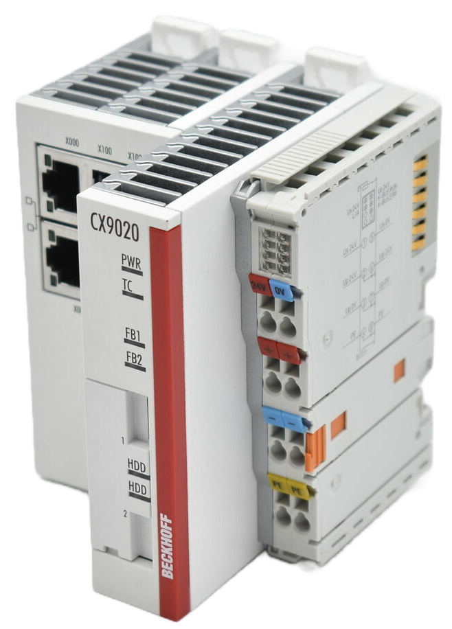

<!-- _class: titlepage -->

# SISTEMI AUTOMATICI

Classi 4° e 5°

## Sistemi di automazione Beckhoff: dispositivi di I/O

Prof. Flavio Barisi - Anno scolastico 2022/23

---

<!-- _class: summarypage -->

# Sommario

- [Descrizione hardware](#descrizione-hardware)

---

<!-- _class: sectionpage -->

# Descrizione hardware

---

# CX9020 | Basic CPU module

---

# CX9020 | Ethercat

  

  - Il PC CX9020 permette la connessione di dispositivi Ethercat tramite i contatti striscianti presenti sul lato destro del dispositivo.
  - Tali contatti permettono il trasferimento dei dati e dell'alimentazione ai moduli Ethercat aggiuntivi
  - L'accoppiatore Ethercat interno è identificato dal codice EK1200
  

  

  
  

---

<!-- _class: small -->

# EL1008 | 8-channel digital input

  

  - EL1008 è un terminale EtherCAT a 8 canali che acquisisce segnali di controllo binario a 24 V dal campo.
  - Caratteristiche elettriche:
    - 24 V DC (-15 %/+20 %)
    - "0" signal voltage	-3…+5 V
    - "1" signal voltage	11…30 V
    - Corrente di input 3 mA
  

  

  
  

---

<!-- _class: small -->

# EL2008 | 8-channel digital output

  

  - EL2008 è un terminale EtherCAT a 8 canali che permette di connettere comandare attuatori sul campo tramite segnali di controllo binari a 24 V DC.
  - Caratteristiche elettriche:
    - 24 V DC (-15 %/+20 %)
    - Corrente massima di output 500 mA
  

  

  
  

---

# EL3064

---

# EL4002

---

# EL7031

---

# EL3202

---

# EL4022

---

# ZK4000-6200-2010

---

# AS1010-0000

---

# EL9011

---

<!-- _class: small -->

# Modifica delle variabili

  - Per poter mappare le variabili con i dispositivi di I/O queste devono essere assegnate all'area di memoria corretta.
  - Modificare la variabile di output dichiarandola come output (AT %Q*).
  - Modificare le variabili dichiarandole come input (AT %I*).
  - Ricompilare il progetto PLC

  

---

# Mapping delle variabili

- Per poter collegare i dispositivi dal campo (sensori e attuatori), dopo aver definito delle variabili di input output e successivamente, associarle ai dispositivi di I/O Ethercat.
- Verificare quali variabili sono a disposizione, controllando la sezione **Project instance** all'interno del progetto PLC.