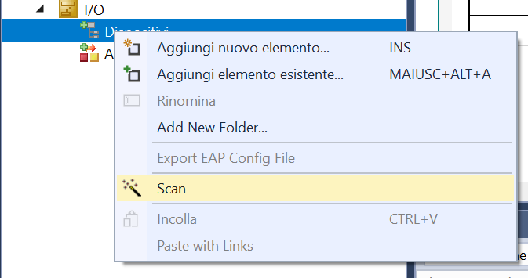

<!-- _class: titlepage -->


<div class="shape"></div>
<div class="spacer"></div>

# SISTEMI AUTOMATICI

Classi 4° e 5°

## Sistemi di automazione Beckhoff: dispositivi di I/O

<div class="spacer"></div>

Prof. Flavio Barisi - Anno scolastico 2022/23

---

<!-- _class: summarypage -->

# Sommario

- [Descrizione hardware](#descrizione-hardware)

---

<!-- _class: sectionpage -->

# Descrizione hardware

---

# CX9020 | Basic CPU module


---

# CX9020 | EtherCAT


<div class="columns">
  <div>

  - Il PC CX9020 permette la connessione di dispositivi EtherCAT tramite i contatti striscianti presenti sul lato destro del dispositivo.
  - Tali contatti permettono il trasferimento dei dati e dell'alimentazione ai moduli EtherCAT aggiuntivi
  - L'accoppiatore EtherCAT interno è identificato dal codice EK1200
  </div>
  <div>

  
  </div>
</div>

---

<!-- _class: small -->

# EL1008 | 8-channel digital input

<div class="columns">
  <div>

  - EL1008 è un terminale EtherCAT a 8 canali che acquisisce segnali di controllo binario a 24 V dal campo.
  - Caratteristiche elettriche:
    - 24 V DC (-15 %/+20 %)
    - "0" signal voltage	-3…+5 V
    - "1" signal voltage	11…30 V
    - Corrente di input 3 mA
  </div>
  <div>

  
  </div>
</div>

---

<!-- _class: small -->

# EL2008 | 8-channel digital output

<div class="columns">
  <div>

  - EL2008 è un terminale EtherCAT a 8 canali che permette di connettere comandare attuatori sul campo tramite segnali di controllo binari a 24 V DC.
  - Caratteristiche elettriche:
    - 24 V DC (-15 %/+20 %)
    - Corrente massima di output 500 mA
  </div>
  <div>

  
  </div>
</div>

---


# EL3064


---

# EL4002


---

# EL7031


---

# EL3202


---

# EL4022


---

# ZK4000-6200-2010


---

# AS1010-0000


---

# EL9011


---

<!-- _class: sectionpage -->

# Configurazione I/O su TwinCAT

---

<!-- _class: small -->

# Aggiunta dei dispositivi di I/O

<div class="columns">

  - I dispositivi di Input e Output sono contenuti all'interno della cartella *I/O* del progetto TwinCAT
  - È possibile aggiungere i dispositivi EtherCAT in 2 modi: tramite una scansione automatica o tramite l'inserimento manuale. L'ordine di inserimento deve necessariamente rispecchiare l'ordine di inserimento all'interno del quadro di automazione.
  - La scansione automatica necessità del collegamento fisico al PC industriale su cui è collegato il Master EtherCAT e della modalità operativa **Config Mode**

  <div>

  

  </div>
</div>

---

<!-- _class: small -->

# Inserimento manuale dei dispositivi

<div class="columns">

  - Fare click con il tasto destro sulla cartella **Dispositivi** e premere **Aggiungi nuovo elemento**. Selezionare **EtherCAT Master**. Lasciare il nome di default Dispositivo 1
  - Fare click con il tasto destro sul **Dispositivo 1** e premere **Aggiungi nuovo elemento**. Selezionare **EK-1200-5000** ovvero il power supply EtherCAT contenuto all'interno del PC CX9020.

  <div>

  

  </div>
</div>

---

<!-- _class: small -->

# Inserimento manuale dei dispositivi

<div class="columns">

  - Fare click con il tasto destro sull'elemento **EK-1200** e premere **Aggiungi nuovo elemento**. Inserire in sequenza i seguenti dispositivi:
    - EL1008
    - EL2008
    - EL3064
    - EL4002
    - EL7031
    - EL3202
    - EL4022
    - EL9011

  <div>

  

  </div>
</div>

---

<!-- _class: small -->

# Scansione automatica

<div class="columns">

  - Riavviare il PC Industriale in modalità **Config mode**
  - Fare click con il tasto destro sulla cartella Dispositivi e premere **Scan**
  - Premere **OK** all'avviso che non tutti i dispositivi sono rilevabili automaticamente
  - Selezionare **Dispositivo 1 (EtherCAT)**
  - Premere **Sì** alla richiesta di effettuare lo scan dei box in modo da effettuare lo scan di tutti i dispositivi
  - Premere **Cancel** alla richiesta di aggiungere una configurazione **Motion**

  <div>

  

  </div>
</div>


---

<!-- _class: small -->

# Modalità Free Run

<div class="columns">

  - La richiesta successiva da parte di TwinCAT è quella di attivare o meno la modalità **Free Run**
  - Questo comando configura i dispositivi I/O individuati in modalità Free Run. Questo significa, ad esempio, che il Bus terminal può scrivere sui canali di I/O un certo stato senza che ci sia un progetto PLC o un altro task attivo che scateni l'evento.
  - Questa modalità non è necessaria per gli scopi di questo corso, quindi è possibile selezionare **No** 

  <div>

  

  </div>
</div>


---

# Tipo di variabili

- Durante la dichiarazione delle variabili, è stato finora specificato solo l'etichetta ed il tipo. 
- Se non viene specificato l'indirizzo della variabile, questa risulta essere interna al PLC e utilizzabile per memorizzare un dato.
- è possibile assegnare un indirizzo di memoria, in modo da utilizzare la variabile per una funzione specifica:
  - Memoria di input (I): sensori
  - Memoria di output (Q): attuatori
  - Memoria di flag o Merker (M): utilizzate per memorizzare risultati intermedi durante l'esecuzione del programma

---

<!-- _class: small -->

# Modifica delle variabili

<div class="columns">

  - Per poter mappare le variabili con i dispositivi di I/O inseriti in precedenza, è necessario assegnarle all'area di memoria corretta.
  - Modificare la variabile di output dichiarandola come output (AT %Q*).
  - Modificare le variabili dichiarandole come input (AT %I*).
  - Ricompilare il progetto PLC

  ```iecst
  {attribute 'qualified_only'}
  VAR_GLOBAL
    MotorActive AT %Q* : BOOL;
    StartMotor AT %I* : BOOL;
    StopMotor AT %I* : BOOL;
  END_VAR
  ```

</div>

---

# Mapping delle variabili

- Per poter collegare i dispositivi dal campo (sensori e attuatori), dopo aver definito delle variabili di input output è necessario associarle ai dispositivi di I/O EtherCAT.
- Verificare quali variabili sono a disposizione, controllando la sezione **Project instance** all'interno del progetto PLC.
- Recarsi nella sezione **I/O** del progetto PLC ed individuare il dispositivo di I/O con cui effettuare il mapping della variabile.
- Fare doppio click sulla variabile e selezionare **Collegato a** e scegliere una variabile dall'elenco

---

<!-- _class: sectionpage -->

# Tutorial

---

# Lettura input digitale

<div class="columns">

  - Individuare il dispositivo EL1008 (8 input digitali)
  - Espandere il Channel 1 e fare doppio click su Input
  - Selezionare **Collegato a**
  - Selezionare la variabile di input (**AT %I\***) da mappare e premere su **Ok**

  
  

</div>

---

# Scrittura output digitale

<div class="columns">

  - Individuare il dispositivo EL2008 (8 output digitali)
  - Espandere il Channel 1 e fare doppio click su Output
  - Selezionare **Collegato a**
  - Selezionare la variabile di output (**AT %Q\***) da mappare e premere su **Ok**

  
  

</div>

---

# Lettura input analogico (tensione)

---

# Lettura input analogico (resistenza)

---

# Scrittura output analogico (tensione)

---

# Scrittura output analogico (corrente)