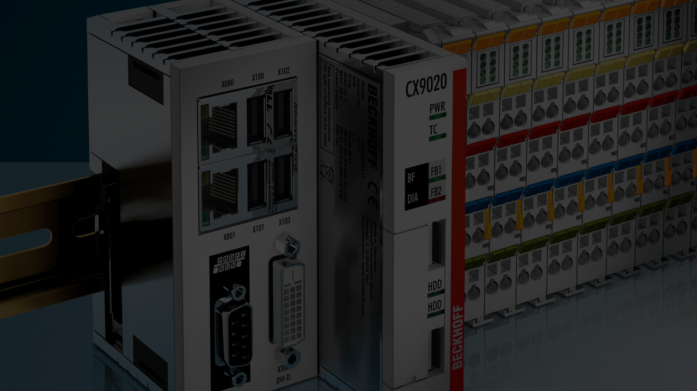
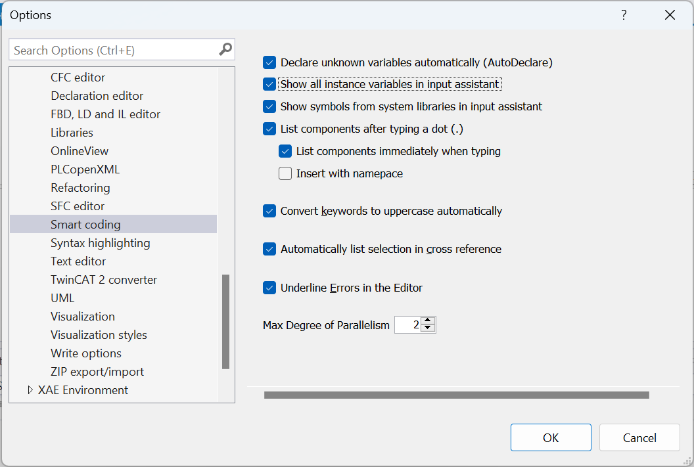

<!-- _class: titlepage -->



<div class="shape"></div>
<div class="spacer"></div>

# SISTEMI AUTOMATICI

Classi 4° e 5°

## Sistemi di automazione Beckhoff: lo standard IEC 61131

<div class="spacer"></div>

Prof. Flavio Barisi - Anno scolastico 2022/23

---

<!-- _class: summarypage -->

# Sommario

- [Introduzione](#introduzione)
- [Descrizione Hardware](#descrizione-hardware)


---

<!-- _class: sectionpage -->

# Lo standard IEC 61131

---

# Lo standard IEC 61131

- Lo standard IEC 61131 è uno standard internazionale per la programmazione dei controllori logici programmabili (PLC).
- La sezione 3 dello standard IEC 61131 definisce cinque linguaggi di programmazione comuni utilizzati nell'automazione industriale. Questi linguaggi offrono un'ampia gamma di funzionalità per soddisfare le esigenze di programmazione dei PLC.
- La scelta del linguaggio IEC 61131 dipende dalle esigenze specifiche dell'applicazione in quanto ogni linguaggio ha vantaggi e limitazioni. È possibile utilizzare più linguaggi all'interno di uno stesso progetto per sfruttare al meglio le loro caratteristiche.

---

<!-- _class: small -->

# I cinque linguaggi IEC 61131-3

1. **Ladder Diagram (LD)**: Basato su diagrammi a contatti e bobine, simula il funzionamento di un circuito elettrico. Utilizzato principalmente per controlli sequenziali.
2. **Structured Text (ST)** Linguaggio di programmazione di alto livello simile al Pascal o al C. Consente l'implementazione di algoritmi complessi.
3. **Function Block Diagram (FBD)** Basato sulla rappresentazione grafica di blocchi funzionali interconnessi. Utilizzato per la programmazione di controlli logici complessi.
4. **Instruction List (IL)** Linguaggio di basso livello simile all'Assembly Utilizzato per programmi semplici e ottimizzati.
5. **Sequential Function Chart (SFC)** Linguaggio basato su grafici di stato e diagrammi di flusso. Utilizzato per il controllo di macchine e processi complessi.
---

# Variabili

- Le variabili sono elementi fondamentali nella programmazione PLC. Sono dei contenitori dove i dati vengono memorizzati e manipolati all'interno di un programma.
- Le variabili possono essere utilizzate per conservare valori temporanei, risultati intermedi o dati di input/output.
- Nel contesto dello standard IEC 61131, esistono numerosi Data Type disponibili per le variabili. I Data Type definiscono il tipo di dato che una variabile può contenere, le operazioni che possono essere eseguite su di essa e la quantità di memoria allocata per ogni variabile.

---


<!-- _class: small -->

# Data Type dello standard IEC 61131

| | |
| --------------- | -------------------------------------- |
| **BOOL**            | Tipo booleano (1 bit, vero o falso)           |
| **BYTE**            | Tipo di dato intero a 8 bit [0..255]    |
| **WORD**            | Tipo di dato intero a 16 bit [0..65535]          |
| **DWORD**           | Tipo di dato intero a 32 bit [0..4294967295]          |
| **LWORD**           | Tipo di dato intero a 64 bit [0..2<sup>64</sup>-1]          |           |
| **SINT**            | Tipo di dato intero con segno a 8 bit [-128..127] |
| **INT**             | Tipo di dato intero con segno a 16 bit [-32768..32767] |
| **DINT**            | Tipo di dato intero con segno a 32 bit [-2147483648..2147483647] |
| **LINT**            | Tipo di dato intero con segno a 64 bit [-2<sup>63</sup>..2<sup>63</sup>-1]|
| **USINT**           | Tipo di dato intero senza segno a 8 bit [0..255] |
| **UINT**            | Tipo di dato intero senza segno a 16 bit [0..65535] |

---

<!-- _class: small -->

# Data Type dello standard IEC 61131

| | |
| --------------- | -------------------------------------- |
| **UDINT**           | Tipo di dato intero senza segno a 32 bit [0..4294967295] |
| **ULINT**           | Tipo di dato intero senza segno a 64 bit [0..2<sup>64</sup>-1] |
| **REAL**            | Tipo di dato a virgola mobile a 32 bit (≈ 10 <sup>38</sup>) |
| **LREAL**           | Tipo di dato a virgola mobile a 64 bit (≈ 10 <sup>308</sup>)|
| **TIME**            | Tipo di dato per rappresentare il tempo a 32 bit |
| **LTIME**            | Tipo di dato per rappresentare il tempo a 64 bit |
| **DATE**            | Tipo di dato per rappresentare la data (32 bit) |
| **TIME_OF_DAY**     | Tipo di dato per rappresentare l'ora del giorno (32 bit) |
| **DATE_AND_TIME**   | Tipo di dato per rappresentare data e ora (32 bit) |
| **STRING**          | Tipo di dato per rappresentare una stringa |
| **WSTRING**         | Tipo di dato per rappresentare una stringa UNICODE |

---

# Etichette

- Nella programmazione PLC, le **label** o etichette sono nomi simbolici associati alle variabili. Servono a identificare in modo univoco le variabili all'interno del programma.
- Le label migliorano la leggibilità e la comprensibilità del codice, consentendo di assegnare nomi significativi alle variabili. Di seguito alcuni esempi:
  - **Temperature**
  - **MotorSpeed**
  - **ValveStatus**
  - **PressureSetpoint**
---

# Dichiarazione delle variabili

- Nello standard IEC 61131, le variabili vanno dichiarate prima di essere utilizzate nel programma PLC. La dichiarazione delle variabili include la specifica del nome, del tipo di dato, delle proprietà (se necessario) ed il valore iniziale se presente.
- La sintassi generale per dichiarare una variabile è:

  ```iecst
  VAR
      <nome>: <tipo di dato>;
  END_VAR
  ```
---

# Esempio di dichiarazione

```iecst
VAR
    Temperature: REAL; // Variabile per la temperatura
    MotorSpeed: INT; // Variabile per la velocità del motore
    ValveStatus: BOOL; // Variabile per lo stato della valvola
    Counter: DINT := 0; // Variabile per un contatore inizializzata a 0
    SensorData: ARRAY [0..9] OF WORD; // Variabile array per i dati del sensore
END_VAR
```
---

<!-- _class: small -->

# Assegnazione delle variabili

- Variabile booleana
  - **TRUE**
  - **FALSE**
- Variabile numerica
  - decimale: Es. **14**
  - binario (è possibile inserire un _): Es. **2#1001_0011**
  - ottale: Es. **8#67**
  - esadecimale Es. **16#A**
- Variabile reale
  - **7.4**
  - **1.64e+009**
---

<!-- _class: small -->

# Assegnazione delle variabili

- Variabile di tipo stringa
  - **'Questa è una stringa'**
- Variabile TIME/LTIME
  - **T#14MS**
  - **T#1D12H34M15S500MS**
  - **LTIME#100D2H30M40S500MS600US700NS**
- Variabile DATE
  - **D#1972-03-29**
- Variabile TIME_OF_DAY
  - **TOD#15:36:30.123**
  - **TOD#00:00:00**
- Variabile DATE_AND_TIME
  - **DT#1972-03-29-00:00:00**

---

# Struttura a due sezioni dell'editor

- L'interfaccia di editing del codice in un ambiente di sviluppo per sistemi di automazione industriale è generalmente divisa in due sezioni. La sezione di **dichiarazione** e quella di **implementazione**.
- Questa divisione in due sezioni separate offre una chiara distinzione tra la gestione delle variabili e la scrittura del codice, migliorando l'organizzazione e la comprensione del progetto.
- Nell'atto di creazione di una **POU**, l'utente può scegliere il linguaggio di implementazione tra uno dei 5 linguaggi definiti dallo standard IEC 61131

---


# Linguaggio Ladder

- Il linguaggio Ladder è stato il primo linguaggio disponibile per programma i PLC. Si basa su simboli di provenienza "elettrica": binari di potenza (power rail), contatti elettrici (contact) e avvolgimenti magnetici (coil)
- È costituito in linee verticali dette **rung**. Ciascun rung può contenere **contatti**, **coil**, **Function Block** e **Funzioni**
- Ciascun **rung** deve essere connesso necessariamente al binario di potenza sinistro (left power rail), mentre il collegamento con quello destro è opzionale

---

# Linguaggio ST


---

# Linguaggio ST: IF ELSE

<div class="columns">
  <div>

  

  </div>
  <div>

  
  </div>
</div>

---

# Linguaggio ST: IF

<div class="columns" style="align-items: start">
  <div>

  **IF Statement**

  ```iecst
  PROGRAM MAIN
  VAR
    Condition   : BOOL;
    Message     : STRING  := '';
  END_VAR
  ```
  <div class="line" style="width:100%"></div>

  ```iecst
  IF condition THEN
    Message := 'The condition is true';
  END_IF
  ```

  </div>
  <div>

  **IF ELSE Statement**

  ```iecst
  PROGRAM MAIN
  VAR
    Condition   : BOOL;
    Message     : STRING  := '';
  END_VAR
  ```
  <div class="line" style="width:100%"></div>

  ```iecst
  IF condition THEN
    Message := 'The condition is true';
  ELSE
    Message := 'The condition is false';
  END_IF
  ```

  </div>
</div>


---

# Linguaggio ST: Commenti


- Un commento è una porzione di testo nel codice sorgente che viene ignorata dal compilatore o dall'interprete e vengono utilizzati per documentare il codice e facilitarne la manutenzione.
- I commenti su una sola riga iniziano con il carattere "//" mentre quelli su più righe sono delimitati dai caratteri "/*" all'inizio e "*/" alla fine.

```iecst
x:=5; // this is a single line comment
/* 
Multiline comment
*/

```

---

# Auto Declare e Input Assistance

- L'Auto Declare è una funzionalità di TwinCAT che semplifica la dichiarazione delle variabili
- L'Input Assistant fornisce informazioni dettagliate sulle istruzioni, inclusi i parametri richiesti, i tipi di dati supportati e una descrizione delle funzionalità. Questa documentazione aiuta gli sviluppatori a comprendere meglio l'utilizzo corretto delle istruzioni e a evitare errori di sintassi.
- Entrambe le funzioni sono accessibili facendo click con il tasto destro all'interno di una finestra di codice

---

# Smart Coding

<div class="columns">
  <div>

- La modalità Smart Coding in TwinCAT è una potente funzionalità che utilizza l'intelligenza artificiale per migliorare l'efficienza, la precisione e la qualità della scrittura del codice.
- Per attivare la modalità Smart Coding, fare click su Tools -> Options -> TwinCAT -> PLC Environment -> Smart Coding
  </div>
  <div>

  
  </div>
</div>

---

<!-- _class: sectionpage -->

# Task PLC Multipli

---

# Creare il progetto

- Creare un nuovo progetto TwinCAT e creare un nuovo progetto PLC all'interno
- Aprire il Program MAIN ed inserire all'interno il seguente codice:

```iecst
PROGRAM MAIN
VAR
  Test  :  DINT;
END_VAR
```
<div class="line" style="width:100%"></div>

```iecst
Test:=Test+1;
```

---

# Creare un nuovo Task PLC

- Per creare un nuovo task, fare click su System -> Tasks -> Add new item. Selezionare il tipo TwinCAT Task ed assegnare un nome al task (ad esempio PlcTask2). Modificare il Cycle Time in 5 ms
- Creare un nuovo Program, facendo click su POUs -> Add POU. Selezionare il tipo Program ed assegnare il nome MAIN2
- Per associare il Task ed il Program appena creato, fare click sul progetto PLC e poi su **Referenced Task**. Selezionare il Task creato in precedenza.
- Fare click sul nuovo Task all'interno del progetto e selezionare **Add -> Existing item** e selezionare il Program creato in precedenza.

---

# Esecuzione e Watch list

- Copiare il codice dal Program MAIN a quello MAIN2, chiamando la variabile **test2**
- Attivare la configurazione, eseguire il Login
- Fare click con il tasto destro sulla variabile **test** e selezionare **Add Watch**. Ripetere l'operazione per il programma MAIN2 per la variabile **test2**
- Aprire la Watch List facendo click su PLC -> Windows  -> Watch 1
- Avviare l'applicazione e verificare che le variabili cambiano valore con velocità diversa
