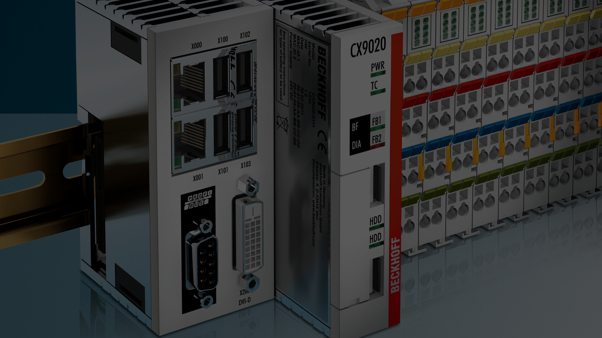

<!-- _class: titlepage -->



<div class="shape"></div>
<div class="spacer"></div>

# SISTEMI AUTOMATICI

Classi 4° e 5°

## Sistemi di automazione Beckhoff: dispositivi di I/O

<div class="spacer"></div>

Prof. Flavio Barisi - Anno scolastico 2022/23

---

<!-- _class: summarypage -->

# Sommario

- [Task PLC Multipli](#task-plc-multipli)

---

<!-- _class: sectionpage -->

# Task PLC Multipli

---

# Creare il progetto

- Creare un nuovo progetto TwinCAT e creare un nuovo progetto PLC all'interno
- Aprire il Program MAIN ed inserire all'interno il seguente codice:

```iecst
PROGRAM MAIN
VAR
  Test  :  DINT;
END_VAR
```
<div class="line" style="width:100%"></div>

```iecst
Test:=Test+1;
```

---

# Creare un nuovo Task PLC

- Per creare un nuovo task, fare click su System -> Tasks -> Add new item. Selezionare il tipo TwinCAT Task ed assegnare un nome al task (ad esempio PlcTask2). Modificare il Cycle Time in 5 ms
- Creare un nuovo Program, facendo click su POUs -> Add POU. Selezionare il tipo Program ed assegnare il nome MAIN2
- Per associare il Task ed il Program appena creato, fare click sul progetto PLC e poi su **Referenced Task**. Selezionare il Task creato in precedenza.
- Fare click sul nuovo Task all'interno del progetto e selezionare **Add -> Existing item** e selezionare il Program creato in precedenza.

---

# Esecuzione e Watch list

- Copiare il codice dal Program MAIN a quello MAIN2, chiamando la variabile **test2**
- Attivare la configurazione, eseguire il Login
- Fare click con il tasto destro sulla variabile **test** e selezionare **Add Watch**. Ripetere l'operazione per il programma MAIN2 per la variabile **test2**
- Aprire la Watch List facendo click su PLC -> Windows  -> Watch 1
- Avviare l'applicazione e verificare che le variabili cambiano valore con velocità diversa
