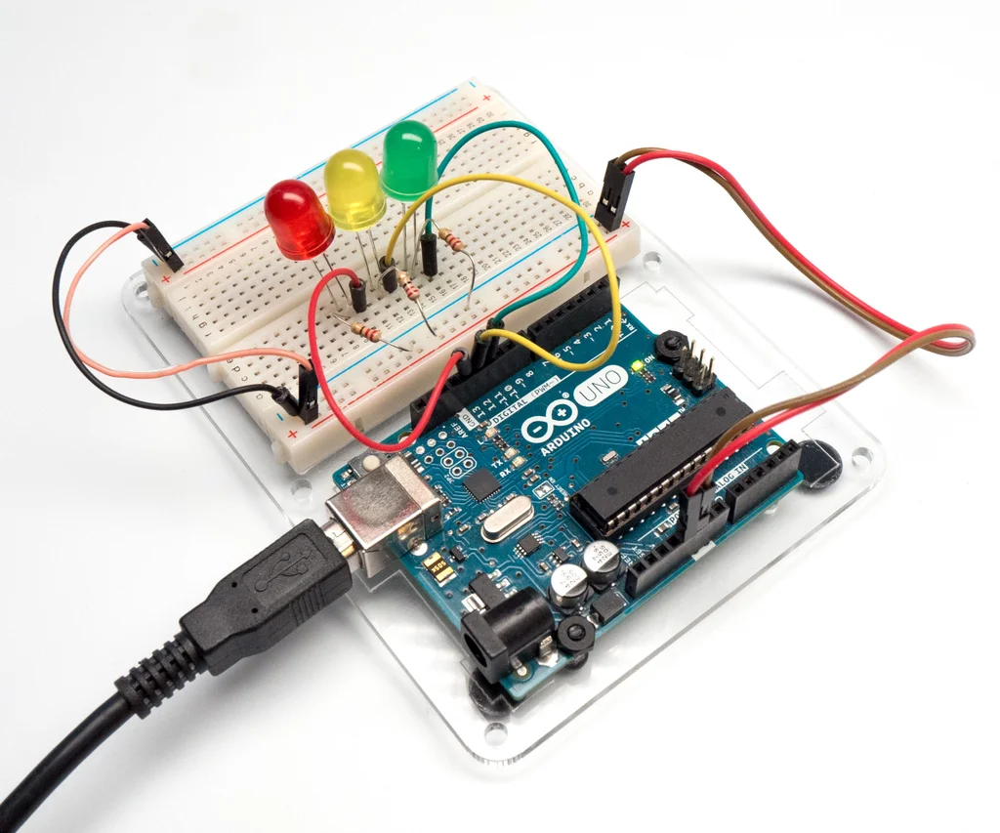

<!-- _class: titlepage -->
<!-- _header: "" -->



<div class="shape"></div>
<div class="spacer"></div>

# TECNOLOGIE INFORMATICHE

Classi 1°

## Arduino

<div class="spacer"></div>

Prof. Flavio Barisi - Anno scolastico 2022/23

---


# Sommario

- Tinkercad
- Lampeggio LED integrato
- Lampeggio LED esterno
- Accensione LED graduale con potenziometro
- Accensione LED con pulsante
- Fotoresistenza

---

<!-- _class: sectionpage -->
<!-- _header: "" -->

# TINKERCAD
---

# Introduzione

Tinkercad è un programma di modellazione 3D e di
simulazione di circuiti elettronici creato da Autodesk. Per accedere:

- Navigare verso il sito https://www.tinkercad.com
- Two Selezionare il pulsante Accedi
- Selezionare Studenti con codice della lezione
- Inserire il codice della lezione fornito dal docente
- Inserire il proprio nickname comunicato dal docente

---

# How to write slides

Split pages by horizontal ruler (`---`). It's very simple! :satisfied:

```markdown
# Slide 1

foobar

---

# Slide 2

foobar
```

___

# Bullet list

- One
- Two
- Three

---

# Fragmented list

* One
* Two
* Three

---

# Multi columns in Marp slide

<div class="columns">
<div>


Lorem ipsum dolor sit amet consectetur adipisicing elit. Voluptas eveniet.

</div>
<div>

```cpp
void setup() {
  pinMode(LED_BUILTIN, OUTPUT);
}

void loop() {
  digitalWrite(LED_BUILTIN, HIGH); 
  delay(1000);
  digitalWrite(LED_BUILTIN, LOW);
  delay(1000);
}
```

</div>
</div>