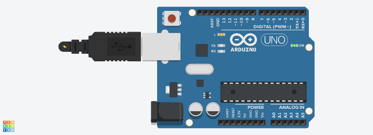

<!-- _class: titlepage -->


<div class="shape"></div>
<div class="spacer"></div>

# TECNOLOGIE INFORMATICHE

Classi 1°

## Arduino

<div class="spacer"></div>

Prof. Flavio Barisi - Anno scolastico 2022/23

---

# Sommario

- Tinkercad
- Lampeggio LED integrato
- Lampeggio LED esterno
- Accensione LED graduale con potenziometro
- Accensione LED con pulsante
- Fotoresistenza

---

<!-- _class: sectionpage -->

# Thinkercad
---

# Introduzione

Tinkercad è un programma di modellazione 3D e di
simulazione di circuiti elettronici creato da Autodesk. Per accedere:

- Navigare verso il sito [Tinkercad](https://www.tinkercad.com)
- Selezionare il pulsante **Accedi**
- Selezionare **Studenti con codice della lezione**
- Inserire il codice della lezione fornito dal docente
- Inserire il proprio nickname comunicato dal docente

---

# Panoramica


--- 

# Creazione di un nuovo progetto

<div class="columns">
  <div>

  - Premere il pulsante **Crea** 
  - Selezionare **Circuito**
  - Per aggiungere un componente, fare click sul componente e posizionarlo nel layout del progetto a sinistra
 
  </div>
  <div>

  
  </div>
</div>

---

<!-- _class: sectionpage -->

# Lampeggio LED integrato

---

# Istruzioni


- Aggiungere al progetto un componente **Arduino Uno R3**
- Premere il pulsante **Codice** in alto a destra. 
- Scegliere dal menù a discesa la voce **Testo**
- Non è necessario modificare il codice proposto
- Premere il pulsante **Avvia simulazione**. Si può notare il LED chiamato **L** lampeggiare, restando acceso per un secondo e spento per un altro secondo.

---


# Schema Elettrico



---

# Variazioni

<div class="columns">
<div>

- Modificare il codice di Arduino con il seguente frammento. Cosa cambia?
- Provare a modificare il programma per ottenere un risultato diverso.

</div>
<div>

```cpp
void setup()
{
  pinMode(LED_BUILTIN, OUTPUT);
}

void loop()
{
  digitalWrite(LED_BUILTIN, HIGH);
  delay(2000); // Wait for 2000 millisecond(s)
  digitalWrite(LED_BUILTIN, LOW);
  delay(2000); // Wait for 2000 millisecond(s)
}
```

</div>
</div>

---

<!-- _class: sectionpage -->

# Lampeggio LED esterno

---

<!-- _class: small -->

# Istruzioni

- Aggiungere al progetto un componente **Arduino Uno R3**
- Aggiungere al progetto una **breadboard piccola**, un **resistore** dal valore di 220 Ω ed un LED seguendo lo schema elettrico.
- Effettuare i collegamenti seguendo lo schema elettrico e rispettando
l'orientamento del LED.
- Premere il pulsante **Codice** in alto a destra.
- Scegliere dal menù a discesa la voce Testo
- Modificare il codice secondo quanto riportato nelle slide successive
- Premere il pulsante Avvia simulazione. Si può notare il LED esterno lampeggiare, restando acceso per un secondo e spento per un altro secondo.

---


# Schema Elettrico


---


# Video di approfondimento

[](https://www.youtube.com/watch?v=YqHkULDmmGU "RGB LEDs With Arduino in Tinkercad")

